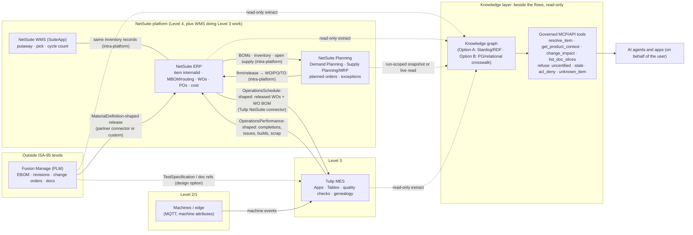

# QCo Target-State Architecture Brief: Fusion Manage, NetSuite (ERP, Planning, WMS), Tulip MES, ISA-95/B2MML, and a Knowledge Graph as the AI Foundation

> **Superseded recommendation (2026-10-07).** This brief's recommendation of a thinner crosswalk store as the starting point has been replaced. Stardog is now the complete product model, covering every product, assembly and sub-assembly, using OWL, SKOS and SHACL. The crosswalk lives inside Stardog as certified ID links. See `QCo-SalesLayer-PIM-Fit-Options-Brief.md` v0.3, §1.

**From:** Knowledge Graph Architect
**For:** Chris (Director of AI & Technology); for onward use with the QCo AI Council and the Agile PM
**Date:** 2026-09-25
**Type:** Conceptual, target-state architecture. This is not an implementation plan.
**Supersedes:** All prior versions: the ISO 15926 draft (never delivered), the first ISA-95 draft, the four-system implementation draft, and interim revisions.
**Builds on:** `memos/QCo-KG-Architecture-POV.md` · `memos/QCo-KG-Council-POV.md` · `memos/QCo-KG-Sprint-1-Work-Plan.md` · `checklists/QCo-Certified-Slices-Minimums-Checklist.md` · `research/QCo-Semantic-KG-Manufacturing-Docs-Research-Pack.md`

> Target state as specified by Chris, 2026-09-25; no system rollout is assumed or scheduled.

---

## 1. BLUF

1. **The target stack fits ISA-95 cleanly, with one exception.** NetSuite (ERP plus Supply Planning/MRP) is Level 4. Tulip is Level 3. Machines reach Level 3 at Level 2/1 through Tulip connectors. NetSuite WMS does Level 3 inventory work on the Level 4 platform. Fusion Manage (PLM) sits **outside** Levels 0–4 as the engineering source of material and product definitions.
2. **B2MML is a vocabulary here, not a wire format.** Neither NetSuite nor Tulip documents native B2MML support. The realistic target is REST/JSON flows *shaped by* B2MML nouns (MaterialDefinition, OperationsSchedule, OperationsPerformance, TestSpecification). NetSuite ↔ WMS and NetSuite Planning ↔ work orders are intra-platform and involve no exchange at all.
3. **A knowledge graph earns its place as the read-only semantic foundation AI apps share**: one product entity keyed on NetSuite `internalid`, linked through a certified crosswalk to FM item/revision and Tulip records, with provenance per attribute. It must never sit in the transaction path, which belongs to integration.
4. **Verdict on the store:** Stardog/RDF is the strongest fit for "one formally defined, ISA-95-aligned, role-secured semantic layer over four systems" **if the Council accepts the ontology-ownership and RDF-skills cost**. Without that commitment, a thinner property-graph or relational crosswalk behind the same governed MCP tool layer (Option B) delivers most of the AI value at lower operational risk. In both cases, agent reliability comes more from the governed tool layer than from the store.
5. **Recommendation:** make Option B the target-state baseline. Design it so that a Stardog/ISA-95 projection (Option A) is a reversible upgrade. Adopt A when the named triggers in §5 fire. ISA-95 alignment happens in the model now, whatever the store.
6. **The real deliverable is the nine Decisions for the Director in §12.** The most consequential are the store/ownership choice, the crosswalk steward, maintenance and equipment-master ownership, and treating volatile MRP planned orders as snapshots rather than certified facts.

---

## 2. Target-state architecture

### 2.1 System roles and ISA-95 placement

| System | Target role | ISA-95 placement | Basis |
| --- | --- | --- | --- |
| **NetSuite ERP** | Financials, commercial item master (`internalid`), MBOM/assembly BOM, work orders, purchasing, inventory transactions, cost | **Level 4**, business planning and logistics | ISA defines Level 4 as business planning and logistics, including ERP ([ISA-95 overview](https://www.isa.org/standards-and-publications/isa-standards/isa-95-standard); [OPC 10030 §4.2.3](https://reference.opcfoundation.org/specs/OPC-10030/4.2.3)) |
| **NetSuite Planning** (Demand Planning; Supply Planning/MRP) | MPS/MRP output: planned orders (purchase, work, transfer), reschedule/cancel suggestions, exception messages | **Level 4**, the planning side of business logistics | Supply planning "produces planned orders, planning suggestions, and supply planning exceptions" ([Supply Planning Process](https://docs.oracle.com/en/cloud/saas/netsuite/ns-online-help/section_159172577944.html)) |
| **NetSuite WMS** | Putaway, picking, cycle counts on mobile | **Level 3 work on a Level 4 platform.** ISA-95 Part 3 defines inventory operations management as a Level 3 activity | Part 3 splits MOM into production, maintenance, quality and inventory operations management ([ISA-95.00.03-2013 scope/definitions](https://ndls.cnis.ac.cn/standard/detail/931e8c37649a4a972cbb356ce346c0ea)). WMS "extends your NetSuite implementation… each transaction… updates your NetSuite inventory data in real time" ([NetSuite WMS Overview](https://docs.oracle.com/en/cloud/saas/netsuite/ns-online-help/chapter_156382517509.html)) |
| **Tulip** | Operator workflows (Apps), work-order execution, line quality checks, as-built/genealogy in Tulip Tables | **Level 3**, MES/MOM | Level 3 = MES and similar ([ISA](https://www.isa.org/standards-and-publications/isa-standards/isa-95-standard)). Tulip's composable MES covers Production Management, Quality and Inventory ([Tulip cMES overview](https://support.tulip.co/docs/en/composable-mes-overview)) |
| **Machines / edge** | Machine states and attributes | **Level 2/1**, reaching Level 3 through Tulip MQTT/machine connectors and the Machines API | Tulip connectors include MQTT "for machine monitoring" ([Tulip Connectors](https://support.tulip.co/r230/docs/connectors)). Machine scopes exist in the API ([Tulip MCP tool/scopes list](https://support.tulip.co/docs/tulip-mcp-tools-and-use-cases)) |
| **Fusion Manage** (PLM) | Engineering items, EBOM, revisions, change orders, documents, custom properties | **Outside Levels 0–4.** It is the engineering source of Material/Product Definition consumed by Levels 4 and 3 | ISA-95 focuses on the Level 3–4 interface ([ISA](https://www.isa.org/standards-and-publications/isa-standards/isa-95-standard)). Placing PLM outside the hierarchy is **our architectural reading**, not a clause we could quote. |

**Naming precision (verified):**
- **Supply Planning / Material Requirements Planning (MRP)** is enabled by the *Material Requirements Planning* feature. It creates `plannedorder` records tied to a `supplyplandefinition` and a `supplyplanningrun` ([Planned Order record](https://docs.oracle.com/en/cloud/saas/netsuite/ns-online-help/section_159225064324.html)).
- **Demand Planning** is the separate, older feature behind the `itemdemandplan` and `itemsupplyplan` records ([Item Demand Plan](https://docs.oracle.com/en/cloud/saas/netsuite/ns-online-help/section_N3195081.html); [Item Supply Plan REST](https://docs.oracle.com/en/cloud/saas/netsuite/ns-online-help/article_0220040009.html)).
- **NetSuite Planning and Budgeting (NSPB)** is an Oracle Cloud EPM (FP&A) product that syncs financial data from NetSuite. It is **not MRP** ([Planning and Budgeting Sync SuiteApp](https://docs.oracle.com/en/cloud/saas/netsuite/ns-online-help/article_7181743232.html)).
- Which licence bundle (Advanced Inventory, Advanced Manufacturing) QCo holds is **unverified**, and so is whether "Supply Chain Planning" applies.

**Correction to earlier framing:** "Work Definition" is **ISA-95 Part 4** (Clause 6), not Part 2. Part 2 carries **Operations Definition** (Clause 6.1) and **Material Information** (Clause 5.7) ([MESA B2MML V0700 documentation, §1.1 mapping table](https://github.com/MESAInternational/B2MML-BatchML/tree/master/Documentation)).

### 2.2 Target-state diagram



Dashed lines into the knowledge layer are **reads only**. No arrow leaves the knowledge layer toward a system of record.

---

## 3. ISA-95 object models: system of record and consumers

| ISA-95 object model (Part 2/4) | Owning SoR (target) | Consumers | Open design question |
| --- | --- | --- | --- |
| **Material Definition / Class** (Part 2 §5.7) | **Split by field:** FM owns engineering definition (item number, revision, EBOM, spec attributes). NetSuite owns commercial definition (`internalid`, price, cost, MBOM) | NetSuite (item/BOM), Planning, Tulip (WO BOM, rev on screen), KG | Crosswalk steward. Field-authority table (§9.4) |
| **Operations Definition** (Part 2 §6.1: BOM, routing context) | NetSuite MBOM/assembly BOM and routing (feature-dependent) | Planning (planning BOM), Tulip | EBOM→MBOM transformation owner. Routing detail NetSuite vs Tulip |
| **Work Definition / Work Master** (Part 4 §6) | **Tulip** (Apps as executable work instructions) | Operators, KG (which app version builds which item/rev) | How FM docs/revisions govern Tulip app versions |
| **Operations Schedule** (Part 2 §6.2; OperationsType Production) | NetSuite work orders. **Planned orders are not a schedule** until firmed/released into WOs ([Supply Planning Glossary](https://docs.oracle.com/en/cloud/saas/netsuite/ns-online-help/section_163664509886.html)) | Tulip (released WOs), KG | Whether Tulip dispatch (Part 4 Work Schedule) is modeled at all |
| **Planned orders / MPS-MRP output** (Level 4 planning; not a B2MML exchange object) | NetSuite Planning | Planners; KG as snapshot only | Certify or not (§5.4, §12 Q7) |
| **Operations Performance** (Part 2 §6.3) | Tulip (execution truth) → posted to NetSuite as completions/issues/builds (accounting truth) | NetSuite, Planning (on-hand/on-order), KG | Which quantity wins on disagreement: Tulip as-built vs NetSuite posted |
| **Quality: Test Specification / Test Result** (Part 2 §5.9) | Spec: FM (engineering) or Tulip (line check definition). **Unassigned.** Results: Tulip | NetSuite (lot status), KG | Where the spec is mastered. Does a failed check change lot status in NetSuite? |
| **Inventory** (Part 3 IOM, Material Lot) | NetSuite core inventory + WMS (one platform) | Planning, Tulip, KG | Tulip inventory apps: read-only views vs posting transactions |
| **Maintenance** (Part 3 maintenance operations management; OperationsType Maintenance) | **Unassigned.** Tulip's cMES focus areas are production, quality and inventory ([Tulip cMES](https://support.tulip.co/docs/en/composable-mes-overview)). No NetSuite maintenance/CMMS module was verified | — | **Decision required** (§12 Q5) |
| **Equipment / Physical Asset** (Part 2 §5.5–5.6) | **Split:** Tulip stations/machines (operational role-based equipment). NetSuite fixed assets (financial physical asset; module not verified) | KG, Maintenance (if any) | **Decision required** (§12 Q5) |
| **Personnel** (Part 2 §5.4) | IdP (Entra/Okta) for identity. Tulip users/groups for operators. NetSuite employees | KG (only for ACL, never as content) | Operator qualification record owner (low priority) |

B2MML's generic `OperationsType` enumeration (Production, Maintenance, Quality, Inventory, Mixed, Other) confirms that ISA-95 treats all four MOM categories with the same schedule, performance and definition shapes (`B2MML-Common.xsd`, `OperationsType1Type`, [MESA B2MML V0701 schemas](https://github.com/MESAInternational/B2MML-BatchML)).

---

## 4. B2MML-shaped exchange flows (target-state design)

### 4.1 What is and isn't native (verified)

- **B2MML** is MESA's royalty-free XSD implementation of ISA-95. The current repo release is V0701 (2023) ([MESA B2MML](https://mesa.org/topics-resources/b2mml/); [GitHub](https://github.com/MESAInternational/B2MML-BatchML)). MESA also publishes an **untested** JSON Schema variant (the repo README says so).
- **Tulip:** integration uses HTTP, SQL and MQTT Connectors plus the Table API ([Connectors](https://support.tulip.co/r230/docs/connectors); [Table API guide](https://support.tulip.co/docs/table-api-guide)). Tulip's planning guide notes that the Table API "requires a request body in JSON format" ([Plan an integration](https://support.tulip.co/r230/docs/plan-an-integration-between-tulip-and-an-mes-or-erp)). **I found no native B2MML support.**
- **NetSuite:** the interfaces are SuiteTalk REST/SOAP, SuiteQL, RESTlets/SuiteScript and SuiteAnalytics Connect (JDBC/ODBC) ([REST prerequisites](https://docs.oracle.com/en/cloud/saas/netsuite/ns-online-help/article_5085602973.html); [JDBC properties](https://docs.oracle.com/en/cloud/saas/netsuite/ns-online-help/section_4425626714.html)). **I found no native B2MML support.**
- **Tulip ↔ NetSuite:** Tulip publishes a prebuilt NetSuite HTTP connector. It requires a NetSuite script and provides functions such as `getAllReleasedWorkOrder`, `getWorkOrderBOM`, `createWorkOrderCompletion`, `createAssemblyBuild`, `createWorkOrderIssue` and `closeWorkOrder`. Tulip labels it "a good starting point" that you should expect to extend ([NetSuite Apps and Connector](https://support.tulip.co/docs/netsuite-apps-and-connector)).
- **FM → NetSuite:** partner connectors are advertised: vdR Group Nexus ([vdR](https://www.vdr.com/autodesk-fusion-manage-integration-with-oracle-netsuite)) and KETIV DataBridge ([KETIV](https://ketiv.com/ketiv-databridge-for-autodesk-software/)). There is also a customer case using FM scripting plus middleware ([Autodesk partner story](https://www.autodesk.com/support/partners/success-stories/improving-bill-of-materials-management-and-erp-integration-with-plm/10267)). **I found no Autodesk first-party FM–NetSuite connector.** Partner capabilities are vendor claims and have not been tested.
- **Intra-platform (no exchange):** NetSuite ↔ WMS, and NetSuite Planning ↔ work orders/POs. Planners release planned orders, which "are transformed into work orders, purchase orders or transfer orders in the NetSuite" ([Glossary](https://docs.oracle.com/en/cloud/saas/netsuite/ns-online-help/section_163664509886.html)).

**Implication:** full B2MML XML adds a translation layer that has no counterparty. B2MML-*shaped* JSON (ISA-95 names, IDs and semantics in the payload) gets most of the alignment benefit. B2MML's own documentation notes that its IDs "are not intended to act as global object IDs". Cross-system identity therefore needs its own crosswalk regardless ([B2MML V0700 doc §1.5](https://github.com/MESAInternational/B2MML-BatchML/tree/master/Documentation)).

### 4.2 Flow table

| # | Source → Target | B2MML noun / meaning | Trigger | Transport (target state) |
| --- | --- | --- | --- | --- |
| F1 | FM → NetSuite | `MaterialDefinition` (+ `MaterialDefinitionProperty`, assembly elements): released item/rev and EBOM as the input to the MBOM | FM workflow transition to Released. APS webhook `workflow.transition` exists ([APS](https://aps.autodesk.com/en/docs/webhooks/v1/reference/events/flc_events/workflow.transition)) | Partner connector or custom middleware, JSON |
| F2 | NetSuite ERP → Planning | Planning BOM, on-hand, open supply (no B2MML: Level 4 internal) | Planning repository refresh ([Launch a Supply Plan](https://docs.oracle.com/en/cloud/saas/netsuite/ns-online-help/article_0411122451.html)) | Intra-platform |
| F3 | Planning → NetSuite ERP | Planned order → firmed → released WO/PO/TO (no B2MML) | Planner action in the Supply Planning Workbench | Intra-platform |
| F4 | NetSuite → Tulip | `OperationsSchedule` / `OperationsRequest` (Production): released WOs + WO BOM | WO released, or Tulip pull | Tulip NetSuite connector (HTTP/JSON + NetSuite script) |
| F5 | Tulip → NetSuite | `OperationsPerformance` / `OperationsResponse` / `SegmentResponse`: completions, issues, builds, scrap | Operator completes a step or WO | Tulip NetSuite connector functions |
| F6 | FM → Tulip | `MaterialDefinition` (current rev) and `TestSpecification`, plus document references | FM release / change order | **Design option:** HTTP connector from Tulip to the FM v3 API, or via NetSuite |
| F7 | Tulip → NetSuite | `MaterialLot` / `TestResult`: lot genealogy, quality disposition | Quality check outcome | HTTP/JSON (extension of the connector; not in the prebuilt function list) |
| F8 | NetSuite ↔ WMS | Inventory movements (Part 3 IOM) | Mobile transaction | Intra-platform |
| F9 | Machines → Tulip | Level 2 events (outside B2MML's main scope) | Machine state change | MQTT / machine attributes |

Every flow above is **integration**. The KG reads their *results*. It does not relay, orchestrate or retry them.

### 4.3 Fusion Manage → ISA-95/B2MML entity mapping

**What FM exposes (verified, REST v3):**
- **Items:** `GET /api/v3/workspaces/{workspaceId}/items/{itemId}` returns sections/fields, lifecycle, versions, audit, where-used, and BOM links.
- **Bulk and incremental reads:** bulk item details via `Accept: application/vnd.autodesk.plm.items.bulk+json` (100/page). Change detection via the **`If-Modified-Since`** header on the workspace items list, filtered by the caller's permissions. Scroll pagination for 10,001+ items ([Item Details endpoint](https://help.autodesk.com/cloudhelp/ENU/FLC-RestAPI/files/FLC_RestAPI_Advanced_Functionalities_item_details_endpoints_html.htm); [large sets](https://help.autodesk.com/cloudhelp/ENU/FLC-RestAPI/files/FLC_RestAPI_Advanced_Functionalities_Item_details_endpoints_items_large_sets_data_html.htm)).
- **BOM:** `.../items/{itemId}/bom` (use the `application/vnd.autodesk.plm.bom.bulk+json` Accept header for full node/edge payloads) ([BOM GET](https://help.autodesk.com/cloudhelp/ENU/FLC-RestAPI/files/FLC_RestAPI_Resource_Endpoints_Bom_API_v3workspaces_workspaceId_items_itemId_bom_GET_html.htm); [forum on the Accept header](https://forums.autodesk.com/t5/fusion-manage-forum/fusion-360-manage-v3-api-issue-with-item-bom/td-p/8337988)).
- **Versions and workflow history:** `.../versions` and `.../workflows/{workflowId}/history`.
- **Attachments and grid:** `.../attachments` and `.../views/13/rows`.
- **Search and audit logs:** `/api/v3/search-results` and tenant `setup-logs` / `system-logs`.
- BOM field IDs are view-definition specific per tenant. Endpoints for the **Relationships** and **Managed/Affected Items** tabs were **not found in the official docs I read (unverified)**.

**APS Manufacturing Data Model (MFGDM) GraphQL** covers **Fusion design data** in Team hubs: components, hierarchy/BOM and physical properties ([MFGDM overview](https://aps.autodesk.com/en/docs/mfgdataapi/v2/developers_guide/overview); [tutorial](https://autodesk-platform-services.github.io/aps-mfgdm-tutorial/prerequisites/home/)). It exposes **Fusion Manage *Extension* properties** such as lifecycle, item number, revision and change order on design components ([MFGDM v2 GA](https://aps.autodesk.com/blog/manufacturing-data-model-api-v20-now-generally-available); [ECO properties](https://aps.autodesk.com/blog/new-eco-and-occurrence-properties-fusion-data-api)). It **does not expose FM PLM workspaces generally** (Products, Problem Reports, Suppliers and so on). Its role is a design-side CAD-BOM source that complements FM, not a substitute for the FM v3 API.

| FM object / relationship | ISA-95 / B2MML (V0701, element names verified in XSDs) | Fit |
| --- | --- | --- |
| Item (Items & BOMs workspace), revision | `MaterialDefinition` (`ID`, `Version`, `EffectiveStartDate`, `MaterialDefinitionProperty`, `MaterialClassID`) | Good |
| Item category / classification section | `MaterialClass` / `MaterialClassProperty` | Good |
| BOM row (parent, child, qty, UoM) | Assembly elements on `MaterialDefinition` (`AssemblyDefinition`, `AssemblyType`, `AssemblyRelationship`); manufacturing view: `OperationsMaterialBill` / `OperationsMaterialBillItem` (`Quantity`, `MaterialSpecificationID`) | Partial. ISA-95 is a manufacturing-exchange model, not an EBOM model |
| Change order / ECO + affected items | **No ISA-95 object.** Represent as context that changes `Version`/`EffectiveStartDate` on definitions | Gap (QCo extension) |
| Attachments / documents | Doc references. Certified excerpts become QCo `DocSlice` | Gap (QCo extension) |
| Quality spec (if mastered in FM) | `TestSpecification` (`TestSpecificationProperty`, `TestSpecificationCriteria`) | Good |
| Suppliers / sourcing | Out of ISA-95 Part 2 scope (Level 4 purchasing) | Out |
| Problem report / NCR (if configured) | Relates to `TestResult` / quality ops; no direct noun | Partial |

**Ontology availability (verified):** there is **no canonical, standards-body OWL ontology for ISA-95**. The options that exist:
- a DTDL (not OWL) model citing ANSI/ISA-95.00.02-2018 ([Digital Twin Consortium ManufacturingOntologies](https://github.com/digitaltwinconsortium/ManufacturingOntologies); [DTDL ISA-95](https://github.com/JMayrbaeurl/opendigitaltwins-isa95));
- an academic OWL design pattern covering only the equipment hierarchy of DIN EN 62264-2 ([HSU-AUT ODP](https://github.com/hsu-aut/IndustrialStandard-ODP-DINEN62264-2));
- OPC UA's ISA-95 information model ([OPC 10030](https://reference.opcfoundation.org/specs/OPC-10030/4.2.3)).

**Recommendation:** a **thin QCo namespace** with alignment annotations that point to B2MML element names. Do not invent an "ISA-95 ontology" namespace.

### 4.4 Illustrative Turtle/TriG (one product, one BOM line, one change order)

Values are illustrative. The FM URN pattern follows the documented format `urn:adsk.plm:tenant.workspace.item:TENANT.{ws}.{dmsId}`.

```trig
@prefix qco:  <https://kg.qco.example/def/> .
@prefix id:   <https://kg.qco.example/id/> .
@prefix g:    <https://kg.qco.example/graph/> .
@prefix prov: <http://www.w3.org/ns/prov#> .
@prefix xsd:  <http://www.w3.org/2001/XMLSchema#> .
@prefix rdfs: <http://www.w3.org/2000/01/rdf-schema#> .

# Thin vocabulary with ISA-95/B2MML alignment as annotations, not imports
qco:Product         rdfs:comment "One entity per commercial item, keyed on NetSuite internalid" ;
                    qco:b2mmlAlignment "MaterialDefinition (B2MML V0701; ISA-95 Part 2 cl. 5.7)" .
qco:BomLine         qco:b2mmlAlignment "Assembly elements / OperationsMaterialBillItem (approximate)" .
qco:EngineeringChange qco:b2mmlAlignment "none - QCo extension; affects Version/EffectiveStartDate" .

GRAPH g:crosswalk {                      # certified identity only
  id:product-ns-48213 a qco:Product ;
      qco:netsuiteInternalId "48213" ;
      qco:fmItemUrn "urn:adsk.plm:tenant.workspace.item:QCO.57.7830" ;
      qco:crosswalkState qco:approved ; qco:approvedBy id:steward-01 .
}
GRAPH g:fm-ebom-run-2026-09-25T0300 {    # engineering authority
  id:product-ns-48213 qco:engineeringRevision "B" ; qco:fmLifecycle "Production" .
  id:bomline-fm-7830-001 a qco:BomLine ; qco:bomView qco:EBOM ;
      qco:parent id:product-ns-48213 ; qco:child id:product-ns-51002 ;
      qco:quantity 2 ; qco:uom "Each" .
  id:eco-fm-9-1001 a qco:EngineeringChange ;
      qco:fmItemUrn "urn:adsk.plm:tenant.workspace.item:QCO.9.1001" ;
      qco:affects id:product-ns-48213 ; qco:fromRevision "A" ; qco:toRevision "B" ;
      qco:workflowState "Released" .
}
GRAPH g:ns-commercial-run-2026-09-25T0310 {   # commercial authority
  id:product-ns-48213 qco:itemType "Assembly" ; qco:displayName "LX-200 Luminaire" .
}
g:fm-ebom-run-2026-09-25T0300 prov:generatedAtTime "2026-09-25T07:00:00Z"^^xsd:dateTime ;
    qco:sourceSystem "Fusion Manage" ; qco:certification qco:certified .
```

There is one product node, no per-system duplicate, and every attribute's provenance is its named graph.

---

## 5. Knowledge-layer options

### 5.1 The three options

- **A: Full RDF/OWL KG in Stardog**, ISA-95-aligned, over read-only extracts (optionally virtual graphs), named-graph security, SHACL gates.
- **B: Lighter property graph or relational crosswalk** plus catalog and ACL-aware RAG. This is QCo's existing thin-product-graph direction (Council POV), extended to four sources behind the same MCP contract.
- **C: B2MML-shaped point-to-point integration only**, no KG. Cross-system reporting goes through a warehouse with a crosswalk table.

| Criterion | A: Stardog/RDF | B: PG/relational crosswalk + RAG | C: Integration + warehouse |
| --- | --- | --- | --- |
| What it answers | Multi-hop, cross-system, schema-explicit questions. Subclass/equivalence reasoning at query time ([Stardog inference](https://docs.stardog.com/inference-engine/)). Standards-aligned export | Multi-hop identity and change-impact over a frozen thin model. Prose via RAG | Aggregates and fixed joins. Weak at open-ended traversal and agent context |
| Governance overhead | Highest: ontology, SHACL shapes, named-graph ACL design, mapping upkeep | Medium: crosswalk, edge-type freeze, app-level validation, ACL | Lowest for the graph; crosswalk still needed in the warehouse |
| Skills | SPARQL/OWL/SHACL. Scarce in SMB/MSP market | SQL or Cypher. Common | SQL/iPaaS. Common |
| MSP fit | Weak unless Stardog Cloud and a named internal owner | Good (Postgres) / fair (managed LPG) | Good |
| Lock-in | Moderate (RDF standard; Stardog-specific features: VGs, ICV, sensitive properties) | Low (Postgres) / moderate (LPG vendor) | Low–moderate (iPaaS) |
| Reversibility | Good if MCP isolates consumers; data is portable RDF | Good; can project to RDF later | High; can add a graph later |
| AI foundation quality | Strong semantic contract. Voicebox/MCP available (§6) | Strong enough with governed tools | Weak: every AI app re-integrates |

### 5.2 Recommendation and triggers

**Recommendation:**
- The target-state baseline is **Option B behind the governed MCP tool layer**, with ISA-95-aligned names, edge types and B2MML annotations in the model **now**.
- Design the model and crosswalk so that **Option A is a projection, not a rewrite**.
- **Reject C as the AI foundation.** It is fine for transactional integration and KPI reporting, which are needed anyway.

**Triggers that change the recommendation to A** (any one is enough to put A before the Council):
1. An **external interchange requirement**: a customer, regulator or partner requires RDF/SHACL or standards-based product/asset data.
2. **Formal semantics become a need**: cross-system class hierarchies (e.g. MaterialClass trees reconciled across FM, NetSuite and Tulip) change often enough that query-time reasoning beats re-ETL.
3. A **named ontology owner and SHACL steward** with sustained capacity. This is the gating factor, not the software.
4. **Virtual access is required**: live queries over sources that must not be copied, where Stardog virtual graphs are a verified fit.

**Triggers that move toward C:** the change-impact questions in §7 are not asked in practice, or no crosswalk steward can be named.

### 5.3 Does "four-system ISA-95 alignment" count as the named standards need?

- **For:** four systems, one vocabulary, cross-level semantics. RDF gives a formal, testable (SHACL) schema and a standards-aligned export path if an MES counterparty or customer ever needs B2MML. That arguably *is* the Council's standards trigger.
- **Against:** ISA-95 alignment is a **modeling** need, satisfiable by naming, edge types and annotations in any store. No system in the stack speaks B2MML or RDF natively. No external party requires RDF today. Adopting RDF for internal alignment alone buys the skills cost without an interchange payoff.
- **Conclusion:** internal ISA-95 alignment alone **does not** meet the D180 "named standards need" bar in the Council POV. External interchange or formal-reasoning need does. The prior "RDF deferred" decision stands, and the model is made RDF-ready.

### 5.4 NetSuite Planning in the options

MRP adds a strong cross-domain case (§7, Q6), but **it does not by itself favor RDF**. The value lies in joining snapshots of volatile planned orders to stable identities and open change orders. A crosswalk in a property graph or relational store handles that equally well.

---

## 6. AI on the graph and role-based views

### 6.1 The AI-on-graph pattern

**Three ways agents can query, in order of dependability:**

| Pattern | Evidence | Target-state role |
| --- | --- | --- |
| **Governed MCP/API tools**: `resolve_item`, `get_product_context`, `change_impact`, `list_doc_slices`, `related`; refuse codes `uncertified` · `stale` · `acl_deny` · `unknown_item` | Consistent with QCo's MCP v0 contract (Council POV; Architecture POV). Deterministic, testable, auditable | **Default for all agents** |
| **Text-to-query** (NL→SPARQL/Cypher) | Neo4j's Text2Cypher benchmark: fine-tuned GPT-4o reached "more than 30 percent" execution match ([Neo4j](https://neo4j.com/blog/developer/fine-tuned-text2cypher-2024-model/); [arXiv 2412.10064](https://arxiv.org/html/2412.10064)). Over a KG/ontology, GPT-4 reached 54.2% vs 16.7% on raw SQL ([arXiv 2311.07509](https://arxiv.org/abs/2311.07509)), and 72.55% with ontology-based checking and repair, still ~20% error ([arXiv 2405.11706](https://arxiv.org/html/2405.11706)). These are older models on generic benchmarks; current-model numbers for QCo's schema are **unverified** | Expert/analyst tool only, never the product-answer path |
| **GraphRAG** (LLM-extracted communities) | Helps thematic and multi-hop questions; vanilla RAG often wins on fact lookup ([GraphRAG arXiv 2404.16130](https://arxiv.org/abs/2404.16130); [GraphRAG-Bench arXiv 2506.05690](https://arxiv.org/abs/2506.05690)) | Off the certified product path (existing ban) |

**Stardog LLM/MCP (verified):**
- Stardog Voicebox translates natural language to SPARQL grounded in the model ([Voicebox](https://docs.stardog.com/voicebox/)).
- A **Stardog Cloud MCP server** exposes `voicebox_settings`, `voicebox_ask` and `voicebox_generate_query`, with an optional SSO token header ([stardog-cloud-mcp](https://github.com/stardog-union/stardog-cloud-mcp); [Voicebox dev guide](https://docs.stardog.com/voicebox/voicebox-dev-guide/)). This is a **free-form NL-to-query** surface, i.e. the text-to-query pattern. It suits expert exploration but does not replace the governed tools.
- On-prem availability goes through Stardog support ("contact Stardog support" per the README).
- **Tulip also ships an MCP server**, including write tools such as `deleteAllTableRecords` ([Tulip MCP](https://support.tulip.co/docs/tulip-mcp-tools-and-use-cases)). Any agent use of it must be restricted to read scopes.

**"Understanding a product" in graph terms:**

> `Product` (NetSuite `internalid`) → crosswalk → FM item/revision (engineering MaterialDefinition, EBOM lines, change orders, certified DocSlices) → NetSuite MBOM/routing, commercial attributes, cost (restricted) → planned orders (snapshot) and WOs → Tulip WO execution, lots, TestResults, app versions → equipment (Tulip stations/machines).

Each attribute carries source, run timestamp and certification state. The graph becomes the **single semantic source AI reasons over**. New AI apps call the same tools instead of each re-integrating four systems' APIs, auth models and identifiers.

### 6.2 Role-based views with ACL at query time

**Verified security capabilities:**

| Capability | Stardog | Neo4j Enterprise | Postgres behind API |
| --- | --- | --- | --- |
| Unit of control | **Named graph** read/write per user/role ([Named Graph Security](https://docs.stardog.com/operating-stardog/security/named-graph-security)). **Sensitive-property masking** per property group ([Fine Grained Security](https://docs.stardog.com/operating-stardog/security/fine-grained-security)). **No arbitrary triple-level labels** (a triple can sit in its own graph) ([Stardog community](https://community.stardog.com/t/stardog-entitlement-permissions/2435)) | Label, relationship-type and property-based TRAVERSE/READ/MATCH privileges. Property-based access control since 5.24, with a documented performance cost ([Neo4j PBAC](https://neo4j.com/docs/operations-manual/current/authentication-authorization/property-based-access-control/); [read privileges](https://neo4j.com/docs/operations-manual/current/authentication-authorization/privileges-reads/)) | Row-level security policies per role ([Postgres RLS](https://www.postgresql.org/docs/current/ddl-rowsecurity.html)); column control via views/grants |
| Default posture | Named-graph security off by default. `security.named.graphs.empty.allows.access` defaults false ([SecurityOptions](https://docs.stardog.com/javadoc/snarl/com/complexible/stardog/security/SecurityOptions.html)). Default install "minimal and insecure" ([Security Model](https://docs.stardog.com/operating-stardog/security/security-model)) | Must be configured | Must be configured |
| End-user identity | JWT/OAuth from Entra/Okta with `usernameField` and `rolesClaimPath` ([OAuth Integration](https://docs.stardog.com/operating-stardog/security/oauth-integration)). Entra OBO documented for Launchpad ([Entra](https://docs.stardog.com/launchpad/login-providers/microsoft-entra)). LDAP and Kerberos pages exist ([LDAP](https://docs.stardog.com/operating-stardog/security/ldap); [Kerberos](https://docs.stardog.com/operating-stardog/security/kerberos)). CLI `--run-as` impersonation ([icv report](https://docs.stardog.com/stardog-cli-reference/icv/icv-report)) | IdP/SSO integration (not re-verified here) | API layer sets the session role from the OBO token |

**One copy, many views.** The data is partitioned into named graphs by *source × sensitivity* and role permissions are granted on those graphs. There is no per-role duplication. Stardog graph aliases can bundle graphs for a role, and permissions on the alias govern access ([Query Stardog: aliases](https://docs.stardog.com/query-stardog/)). The same matrix is implementable as Neo4j label/property privileges or Postgres RLS.

| Named graph → / Role ↓ | crosswalk | fm-ebom + revisions | fm-change | fm-docslices (certified) | ns-commercial (config, availability, list price) | **ns-cost** (costed BOM, std cost) | ns-mbom-routing | ns-plan-run-* (snapshot) | tulip-exec (WOs, lots) | tulip-quality | equipment |
| --- | --- | --- | --- | --- | --- | --- | --- | --- | --- | --- | --- |
| Engineering | R | R | R | R | R | — | R | — | R | R | R |
| Sales/commercial | R | — (released rev only via tool) | — | R (cutsheets) | R | — | — | — | — | — | — |
| Operations | R | R | R | R | R | — | R | R | R | R | R |
| Planning/purchasing | R | R | R | — | R | masked | R | R | R | — | — |
| Finance | R | — | — | — | R | **R** | R | R | R | — | R |
| Agent | **Inherits the calling user's row; never its own** | | | | | | | | | | |

`masked` means Stardog sensitive-property masking, or column exclusion elsewhere. The cells are **illustrative defaults for the Council to set**, not decisions.

### 6.3 Which option best supports AI plus multi-view? Honest evaluation

**Where Stardog/RDF genuinely wins:**
- one formal, shared schema across four systems;
- query-time subclass/equivalence reasoning without re-ETL;
- named graphs that carry both **provenance** and **security** in a single mechanism;
- virtual graphs over supported sources;
- SHACL validation built in (ICV) ([Data Quality Constraints](https://docs.stardog.com/data-quality-constraints));
- a natural ISA-95/standards export path.

**Where the claim is overstated:**
- **Role views are achievable in a property graph or Postgres.** Neo4j's property-level privileges are, if anything, finer-grained than Stardog's graph- and property-level controls.
- **Agent reliability depends more on the governed tool layer than on the store.** The text-to-query evidence above says free-form querying is not dependable in any store.
- **RDF carries real skills and MSP cost** for a thin-IT organisation.

**Where the claim is right:** **RAG-only is weaker** for cross-domain joins and identity. Agreed.

**Verdict:** *Stardog/RDF is the strongest fit for this requirement if the Council accepts the ontology-ownership and RDF-skills cost; otherwise Option B with the same governed MCP layer captures most of the AI and role-view value at materially lower operational risk, and a RAG-only approach is not sufficient for cross-domain product reasoning.*

### 6.4 Governance specific to AI access

- **Read-only, on behalf of the user.** Agents carry the human user's identity (OBO/token exchange). The MCP service principal handles connectivity only. There is no see-all service account for retrieval.
- **No standing writes** anywhere: FM, NetSuite, WMS, Planning or Tulip. Write tools are stripped from any vendor MCP an agent can reach.
- **Certified slices define the agent path.** Uncertified data triggers a refuse code, not a softer answer.
- **Audit record per call:** user, agent, tool, query/template ID, named graphs touched, result IDs/hashes, source freshness timestamps, refuse reason.
- **Prompt injection:** DocSlice text is untrusted input. Tools return it as quoted evidence, never as instructions. No tool accepts document text as a query parameter.
- **Combined-inference leak:** an agent can combine facts a role may see into a conclusion that role should not see. Materialised or derived facts (e.g. a "margin-at-risk" score from cost and quality) must live in a graph whose ACL is the **intersection** of their inputs. Whether Stardog's query-time reasoning respects named-graph security in every case is **unverified**, so treat inferred triples conservatively.
- **Per-hop ACL:** shared product nodes are pivot points ([Retrieval Pivot Attacks, arXiv 2602.08668](https://arxiv.org/abs/2602.08668); research pack §6). Named-graph security hides triples in unreadable graphs on every hop. The MCP layer still re-checks per hop and does not leak the *existence* of restricted edges.

### 6.5 Product data across FM and NetSuite without conflicting nodes

**One `Product` entity keyed on the certified crosswalk** (NetSuite `internalid` as spine), with **field-level authority** and **provenance per attribute** (named graph per source/run). No duplicate nodes per system and no silent merges. Conflicts are surfaced as disagreements with both values and sources, and the tool returns the authoritative one per §9.4.

---

## 7. When this earns its cost

| # | Cross-domain question | Systems | Warehouse/SQL join equally good? |
| --- | --- | --- | --- |
| Q1 | Which FM change orders (open or just released) affect items with **open NetSuite WOs** and **active Tulip app versions**? | FM, NS, Tulip | **Mostly yes** for a fixed report, *if* the crosswalk exists. The graph wins on open-ended multi-level impact (sub-assemblies, where-used chains) and as agent context |
| Q2 | Which **lots built on a superseded revision** had **failed Tulip quality checks**, and where is that stock now (WMS bin)? | FM, Tulip, NS/WMS | Yes as a known report. Graph advantage is modest |
| Q3 | Where does the **FM EBOM differ from the NetSuite MBOM** for items with open WOs? | FM, NS | Yes (set difference), once EBOM→MBOM line mapping is certified. The mapping is the hard part in either store |
| Q4 | For a customer-facing answer: which **certified cutsheet revision** matches the **released FM rev** of the SKU being quoted? | FM docs, NS | Graph/tool layer is clearly better (identity + DocSlice certification + refuse) |
| Q5 | Which Tulip **stations/machines** built an item whose later quality failures cluster, and are those stations linked to fixed assets? | Tulip, NS | Depends on the equipment-master decision. Either works once IDs are crosswalked |
| **Q6** | Which **MRP exceptions and planned orders** are driven by BOM revisions that an **open FM change order is about to supersede**, and what is the **inventory and open-PO exposure**? | FM, NS Planning, NS/WMS | **Yes for a scheduled report** joining the latest MRP snapshot, the crosswalk and open ECOs. The graph wins when an agent must trace from an exception through pegging to BOM rev to ECO interactively, under the user's ACL |
| Q7 | Recurring exception patterns (e.g. repeated "Insufficient Lead Time") by item family vs engineering churn | NS Planning, FM | Warehouse is **better** (time-series aggregation) |

**Revision-drift risk (the core MRP issue):** MRP plans against the NetSuite **planning BOM/MBOM** ([Supply Planning Process](https://docs.oracle.com/en/cloud/saas/netsuite/ns-online-help/section_159172577944.html)), which can lag an FM engineering change. Q6 is exactly the question no single system answers.

**Where the graph is redundant:** schedule-down and performance-up sync (F4/F5), inventory posting (F8), KPI dashboards, and fixed monthly reports. These belong to integration and the warehouse.

**Governance overhead the graph adds** (qualitative):
- crosswalk stewardship (weekly human confirmation);
- SHACL/validation rule upkeep as sources change;
- per-source ACL mapping (FM roles, NetSuite roles, Tulip groups to graph roles), which is never automatic;
- freshness SLOs per source and refuse-if-stale behaviour;
- ontology/model ownership to prevent drift.

Option A adds RDF skills. Option B adds bespoke traversal and validation code.

**Conclusion:** a warehouse with a crosswalk answers most *scheduled* versions of these questions. The cross-system layer earns its cost when the consumer is an **AI agent or interactive user** who needs traversal, certification state, provenance and refusal under their own identity. NetSuite Planning strengthens the case for a cross-system layer, but not specifically for RDF.

---

## 8. Planned orders: certified slice or live query?

**Verified facts:**
- `plannedorder` is a SuiteScript-supported record (create, read, update, delete, search) carrying `supplyplandefinition`, `supplyplanningrun` and `firmed` ([Planned Order](https://docs.oracle.com/en/cloud/saas/netsuite/ns-online-help/section_159225064324.html)).
- Each supply-planning run deletes existing non-firmed planned orders. Firmed orders persist ([Supply Planning Process](https://docs.oracle.com/en/cloud/saas/netsuite/ns-online-help/section_159172577944.html)).
- Exception types (Insufficient Lead Time, Past Due Demand/Supply, Negative Time Fence Balance, and others) appear as **Workbench view filters** ([planningview record](https://system.netsuite.com/help/helpcenter/en_US/srbrowser/Browser2026_1/script/record/planningview.html); [Workbench views](https://docs.oracle.com/en/cloud/saas/netsuite/ns-online-help/article_164313117883.html)).

**Unverified:** SuiteQL/REST access to `plannedorder`, and any programmatic record for exception messages.

**Recommendation:**
- **Do not certify volatile planned orders.** Their identity is unstable across runs.
- Hold them as a **run-scoped snapshot**: a named graph per MRP run carrying `supplyplanningrun` ID and timestamp, with an expiry equal to the next run.
- **Certify only** firmed/released WOs and POs and **exception-type definitions**.
- Link planned orders to Product via `internalid`, and forward to the WO they became once released.

**Live virtual-graph alternative (feasibility):**
- NetSuite is **not** on Stardog's supported data-source list ([Supported Data Sources](https://docs.stardog.com/virtual-graphs/data-sources/supported-data-sources)).
- SuiteAnalytics Connect offers JDBC (`NetSuite2.com`) ([JDBC properties](https://docs.oracle.com/en/cloud/saas/netsuite/ns-online-help/section_4425626714.html)), but using it as a Stardog VG source is **unverified**.
- Stardog's REST connector (XML/JSON via CData; "available upon request") ([REST Connector](https://docs.stardog.com/virtual-graphs/data-sources/rest-connector-configuration)) against SuiteQL is also **unverified**.
- The feasible pattern is a VG over a **staging Postgres** (a supported source).

**ACL in virtual graphs:**
- The VG connects with *its own* source credentials, so end-user ACL must be enforced in Stardog (virtual-graph and named-graph permissions ([Security Model](https://docs.stardog.com/operating-stardog/security/security-model))).
- Avoid SuiteAnalytics Connect "Read All", which Oracle warns "exposes sensitive data such as employee and customer records" ([Roles and Permissions for APIs](https://docs.oracle.com/en/cloud/saas/netsuite/ns-online-help/article_0320025211.html)).
- Live queries also add unpredictable load on NetSuite. Snapshots bound both load and exposure.

---

## 9. Governance as design constraints

### 9.1 Certified slices
Only sources passing the Certified-Slices checklist enter the agent path: owner, review date, invalidation path, query-time ACL, citations and refuse behaviour.

### 9.2 Standing read access per system (verified scoping)

| System | Loader identity | What scoping actually supports | Caveat |
| --- | --- | --- | --- |
| **Fusion Manage** | APS app (2-legged) + `X-user-id` impersonating a **dedicated read-only FM user**. The app must be on the tenant's allowed list ([2-legged tutorial](https://help.autodesk.com/cloudhelp/ENU/FLC-RestAPI/files/FLC_RestAPI_v3_API_2_legged_Tutorial_html.htm)) | "All calls… are tied to the user specified". Read-only is enforced by that user's FM roles. `If-Modified-Since` results are permission-filtered | Anyone holding the APS client secret can pass any active user's email. Whether FM restricts which users an app may impersonate is **unverified**, so vault the secret. FM API rate limits: **not found in the docs I read** |
| **NetSuite** (ERP, Planning, WMS) | Token-based auth, custom **integration role** | REST requires REST Web Services (Full), Log in using Access Tokens (Full) and SuiteAnalytics Workbook (Edit). Data access comes from **View-level record permissions** on the role. Administrator role not recommended ([REST prerequisites](https://docs.oracle.com/en/cloud/saas/netsuite/ns-online-help/article_5085602973.html)) | "Full" on REST Web Services is a gateway permission, not write access to records. Exclude cost fields unless the finance graph needs them. No Connect "Read All" |
| **Tulip** | Service account / API token with **read scopes** (`tables:read`, `machines:read`, `stations:read`, `users:read`, `apps:read`), account- or workspace-scoped ([Set up a Tulip API](https://support.tulip.co/docs/set-up-a-tulip-api); [scopes by tool](https://support.tulip.co/docs/tulip-mcp-tools-and-use-cases)) | Scopes are per resource type and read/write | **Per-table scoping was not found in the docs.** `tables:read` appears to cover all tables in scope (unverified) |
| **Graph store** | Loader writes only to its own staging/named graphs | Stardog named-graph write permissions per loader | Serving users get read-only |

### 9.3 Identity and ACL
- NetSuite `internalid` is the commercial spine.
- FM item/rev (URN/dmsID) and Tulip record IDs link through a **certified crosswalk** (`candidate` → `approved`/`rejected`), **never fuzzy-matched**.
- Query-time ACL runs on the end user's identity (OBO). Stardog named-graph security, or the equivalent in B, is enforced **and** re-checked per hop in the MCP layer.
- **No standing write privileges** for the graph or agents into FM, NetSuite, Planning, WMS or Tulip. Integration flows (F1–F9) hold their own narrowly scoped write credentials, separate from anything the knowledge layer can reach.

### 9.4 Field authority

| Attribute family | Authoritative source |
| --- | --- |
| Engineering revision, EBOM, spec attributes, change orders, engineering docs | **FM** |
| Commercial item (`internalid`), price, cost, MBOM/assembly BOM, routing, WOs, POs | **NetSuite** |
| Planned orders, exceptions (non-authoritative snapshot) | **NetSuite Planning** |
| Inventory position, bins, lots on hand | **NetSuite (incl. WMS)** |
| As-built, execution steps, line quality results, station/machine events | **Tulip** |
| Marketing/cutsheet claims | Certified DocSlice owner (per Council POV) |

### 9.5 Thin-IT/MSP fit
- The knowledge layer sits on Chris's app plane, not on the NetSuite host or MSP "extra VM" (Council POV).
- Option B keeps to one database the MSP already understands.
- Option A requires a managed Stardog (Cloud) offering **and** an internal model owner. The MSP cannot own the ontology.

---

## 10. Architecture Decision Record

**Target state in brief:**
- Four systems, integrated point-to-point with B2MML-shaped JSON; NetSuite Planning and WMS are intra-platform.
- A read-only knowledge layer beside the flows, keyed on NetSuite `internalid` with a certified crosswalk.
- A governed MCP tool layer as the only AI entry point, with role-based views enforced at query time.

| ID | Decision (implied) | Context | Consequences |
| --- | --- | --- | --- |
| ADR-1 | KG is **never** in the transaction path | Schedules and performance need reliable, retried integration | KG can be down without stopping production; freshness SLOs required |
| ADR-2 | B2MML is **semantic alignment**, not a wire format | No native B2MML in NetSuite/Tulip | Lower integration cost; a translation layer is needed only if a B2MML counterparty appears |
| ADR-3 | NetSuite `internalid` is the product spine; certified crosswalk to FM/Tulip | Council POV hard-identity rule | Steward capacity is a hard dependency |
| ADR-4 | One Product entity, per-attribute provenance via named graph/source | Avoid duplicate nodes and silent merges | Conflicts are visible and resolved by field authority |
| ADR-5 | Governed MCP tools are the default AI access; free-form NL-to-query is expert-only | Text-to-query reliability evidence | Consistent answers and refusals; slower to add new question types |
| ADR-6 | Option B baseline, A-ready; A on named triggers | RDF-deferral decision + AI-foundation need | Reversible; RDF cost deferred until justified |
| ADR-7 | Volatile planned orders are run snapshots, not certified facts | MRP regenerates non-firmed orders each run | No stale "facts"; history is per-run |

**Open questions (must be resolved before any build):**
1. Is Tulip in the target state?
2. Maintenance SoR.
3. Equipment master authority.
4. Quality spec master (FM or Tulip).
5. EBOM→MBOM mapping owner.
6. Crosswalk steward.
7. Store (A vs B) and ontology owner.
8. AI framework/stack.
9. Planned-order handling.
10. Role-by-graph matrix sign-off (especially cost).
11. FM API rate limits and impersonation restrictions.
12. Whether Stardog query-time reasoning honours named-graph security.

---

## 11. Risks and anti-patterns

| Risk | Mitigation |
| --- | --- |
| Crosswalk rot (no steward) | Named steward or no graph (existing rule) |
| Revision drift FM → MBOM → MRP → Tulip | Q1/Q3/Q6 as standing certified checks; refuse if stale |
| Cost/price leakage via agent aggregation | Sensitivity-partitioned graphs; intersection-ACL for derived facts |
| Ontology skill loss (Option A) | Named owner; keep the model thin; MCP isolates consumers |
| Integration writes mistaken for graph writes | Separate credentials, planes and audits |
| Planning snapshot treated as truth | Run ID + expiry on every planned-order answer |

**Anti-patterns:**
- KG in the transaction path.
- Full B2MML XML with no counterparty.
- Fuzzy-matched FM↔NetSuite identity.
- Duplicate product nodes per system.
- Agents with vendor MCP write tools (Tulip, NetSuite).
- A see-all service account for retrieval.
- Certifying planned orders.
- Text-to-SPARQL/Cypher as the product-answer path.
- GraphRAG as product/price/BOM truth.
- An "ISA-95 ontology" invented as if it were a standard.

---

## 12. Decisions for the Director

1. **Is Tulip in the target state?** If yes, confirm Level 3 ownership of execution and quality results. If not, the Level 3 row and flows F4–F7 collapse into NetSuite. *(Decides: Chris with Ops leadership)*
2. **B2MML-shaped JSON or full B2MML XML?** Recommend shaped JSON now, XML only when a B2MML-speaking counterparty exists. *(Decides: Chris; Architect advises)*
3. **Is a knowledge layer justified over integration/iPaaS plus a warehouse, and which store?** Recommend Option B as baseline, A-ready. Choose Stardog/RDF (A) only if the Council names an external interchange/reasoning need **and** funds a named ontology owner. *(Decides: AI Council)*
4. **Expose the knowledge layer to AI via MCP?** Recommend yes, but only through governed tools extending the MCP v0 contract (`resolve_item`, `get_product_context`, `change_impact`, `list_doc_slices`; refuse codes unchanged). Vendor NL-to-query MCPs are for experts only, and no write tools. Also choose the AI framework/stack against this contract. *(Decides: Chris; Architect advises)*
5. **Who owns Maintenance, and which system is authoritative for the equipment master** (Tulip stations/machines vs NetSuite fixed assets)? Currently unassigned or split. *(Decides: Ops leadership with Finance)*
6. **Identity spine and crosswalk steward.** Confirm NetSuite `internalid` as the single product entity with FM/Tulip crosswalk, field-level authority and per-attribute provenance (no duplicate nodes, no silent merges). Name the steward and weekly hours. *(Decides: Chris; steward from Engineering/Ops)*
7. **NetSuite Planning data:** recommend treating planned orders as run-scoped snapshots (or live reads via a staging copy), certifying only firmed WOs/POs and exception definitions, and no SuiteAnalytics Connect "Read All". *(Decides: Chris with Planning lead)*
8. **Role-by-graph access matrix, especially cost data.** Approve the default matrix in §6.2 and who may see costed BOMs. *(Decides: Finance + Chris; Council ratifies)*
9. **Quality specification master (FM vs Tulip) and the EBOM→MBOM mapping owner.** *(Decides: Engineering + Ops)*

---

## 13. Sources

**QCo internal:** `memos/QCo-KG-Architecture-POV.md`; `memos/QCo-KG-Council-POV.md`; `memos/QCo-KG-Sprint-1-Work-Plan.md`; `checklists/QCo-Certified-Slices-Minimums-Checklist.md`; `research/QCo-Semantic-KG-Manufacturing-Docs-Research-Pack.md`.

**ISA-95 / B2MML:**
- ISA-95 overview: https://www.isa.org/standards-and-publications/isa-standards/isa-95-standard
- OPC 10030 ISA-95 levels: https://reference.opcfoundation.org/specs/OPC-10030/4.2.3
- ISA-95.00.03-2013 abstract/definitions: https://ndls.cnis.ac.cn/standard/detail/931e8c37649a4a972cbb356ce346c0ea
- MESA B2MML: https://mesa.org/topics-resources/b2mml/
- B2MML schemas and docs (V0701 XSDs; V0700 documentation): https://github.com/MESAInternational/B2MML-BatchML
- Digital Twin Consortium ISA-95 (DTDL): https://github.com/digitaltwinconsortium/ManufacturingOntologies
- DTDL ISA-95: https://github.com/JMayrbaeurl/opendigitaltwins-isa95
- HSU-AUT DIN EN 62264-2 ODP: https://github.com/hsu-aut/IndustrialStandard-ODP-DINEN62264-2

**Autodesk:**
- FM REST v3 docs (item details, large sets, BOM, 2-legged tutorial): https://help.autodesk.com/cloudhelp/ENU/FLC-RestAPI/files/FLC_RestAPI_Advanced_Functionalities_item_details_endpoints_html.htm · https://help.autodesk.com/cloudhelp/ENU/FLC-RestAPI/files/FLC_RestAPI_Advanced_Functionalities_Item_details_endpoints_items_large_sets_data_html.htm · https://help.autodesk.com/cloudhelp/ENU/FLC-RestAPI/files/FLC_RestAPI_Resource_Endpoints_Bom_API_v3workspaces_workspaceId_items_itemId_bom_GET_html.htm · https://help.autodesk.com/cloudhelp/ENU/FLC-RestAPI/files/FLC_RestAPI_v3_API_2_legged_Tutorial_html.htm
- APS webhooks (workflow.transition): https://aps.autodesk.com/en/docs/webhooks/v1/reference/events/flc_events/workflow.transition
- APS OAuth v2 token: https://aps.autodesk.com/en/docs/oauth/v2/reference/http/gettoken-POST
- BOM Accept header (forum): https://forums.autodesk.com/t5/fusion-manage-forum/fusion-360-manage-v3-api-issue-with-item-bom/td-p/8337988
- MFGDM overview: https://aps.autodesk.com/en/docs/mfgdataapi/v2/developers_guide/overview
- MFGDM v2 GA: https://aps.autodesk.com/blog/manufacturing-data-model-api-v20-now-generally-available
- MFGDM ECO properties: https://aps.autodesk.com/blog/new-eco-and-occurrence-properties-fusion-data-api
- MFGDM v3: https://aps.autodesk.com/blog/manufacturing-data-model-api-v3
- MFGDM tutorial: https://autodesk-platform-services.github.io/aps-mfgdm-tutorial/prerequisites/home/
- Rename to Fusion Manage: https://www.engineering.com/fusion-360-manage-with-upchain-rebranded-as-autodesk-fusion-manage/

**FM–NetSuite partners:**
- vdR Group: https://www.vdr.com/autodesk-fusion-manage-integration-with-oracle-netsuite
- KETIV DataBridge: https://ketiv.com/ketiv-databridge-for-autodesk-software/
- Autodesk partner story: https://www.autodesk.com/support/partners/success-stories/improving-bill-of-materials-management-and-erp-integration-with-plm/10267

**NetSuite:**
- REST prerequisites: https://docs.oracle.com/en/cloud/saas/netsuite/ns-online-help/article_5085602973.html
- Roles and permissions for APIs: https://docs.oracle.com/en/cloud/saas/netsuite/ns-online-help/article_0320025211.html
- WMS overview: https://docs.oracle.com/en/cloud/saas/netsuite/ns-online-help/chapter_156382517509.html
- Supply Planning: https://docs.oracle.com/en/cloud/saas/netsuite/ns-online-help/section_159171867422.html
- Supply Planning Process: https://docs.oracle.com/en/cloud/saas/netsuite/ns-online-help/section_159172577944.html
- Supply Planning Glossary: https://docs.oracle.com/en/cloud/saas/netsuite/ns-online-help/section_163664509886.html
- Launch a Supply Plan: https://docs.oracle.com/en/cloud/saas/netsuite/ns-online-help/article_0411122451.html
- Planned Order record: https://docs.oracle.com/en/cloud/saas/netsuite/ns-online-help/section_159225064324.html
- Workbench views: https://docs.oracle.com/en/cloud/saas/netsuite/ns-online-help/article_164313117883.html
- planningview record: https://system.netsuite.com/help/helpcenter/en_US/srbrowser/Browser2026_1/script/record/planningview.html
- Item Demand Plan: https://docs.oracle.com/en/cloud/saas/netsuite/ns-online-help/section_N3195081.html
- Item Supply Plan REST: https://docs.oracle.com/en/cloud/saas/netsuite/ns-online-help/article_0220040009.html
- Planning and Budgeting Sync (NSPB): https://docs.oracle.com/en/cloud/saas/netsuite/ns-online-help/article_7181743232.html
- JDBC properties: https://docs.oracle.com/en/cloud/saas/netsuite/ns-online-help/section_4425626714.html
- Work order completion: https://docs.oracle.com/en/cloud/saas/netsuite/ns-online-help/section_N3200062.html

**Tulip:**
- Connectors: https://support.tulip.co/r230/docs/connectors
- Table API guide: https://support.tulip.co/docs/table-api-guide
- Set up a Tulip API: https://support.tulip.co/docs/set-up-a-tulip-api
- NetSuite Apps and Connector: https://support.tulip.co/docs/netsuite-apps-and-connector
- Plan an ERP/MES integration: https://support.tulip.co/r230/docs/plan-an-integration-between-tulip-and-an-mes-or-erp
- cMES overview: https://support.tulip.co/docs/en/composable-mes-overview
- Tulip MCP tools/scopes: https://support.tulip.co/docs/tulip-mcp-tools-and-use-cases

**Stardog:**
- Named Graph Security: https://docs.stardog.com/operating-stardog/security/named-graph-security
- Security Model: https://docs.stardog.com/operating-stardog/security/security-model
- Fine Grained Security: https://docs.stardog.com/operating-stardog/security/fine-grained-security
- SecurityOptions: https://docs.stardog.com/javadoc/snarl/com/complexible/stardog/security/SecurityOptions.html
- OAuth Integration: https://docs.stardog.com/operating-stardog/security/oauth-integration
- Entra: https://docs.stardog.com/launchpad/login-providers/microsoft-entra
- LDAP: https://docs.stardog.com/operating-stardog/security/ldap
- Kerberos: https://docs.stardog.com/operating-stardog/security/kerberos
- icv report: https://docs.stardog.com/stardog-cli-reference/icv/icv-report
- Data Quality Constraints: https://docs.stardog.com/data-quality-constraints
- Inference engine: https://docs.stardog.com/inference-engine/
- Virtual Graphs: https://docs.stardog.com/virtual-graphs/
- Supported Data Sources: https://docs.stardog.com/virtual-graphs/data-sources/supported-data-sources
- JSON/CSV import: https://docs.stardog.com/virtual-graphs/importing-json-csv-files
- REST Connector: https://docs.stardog.com/virtual-graphs/data-sources/rest-connector-configuration
- Query (aliases): https://docs.stardog.com/query-stardog/
- Voicebox: https://docs.stardog.com/voicebox/
- Voicebox dev guide: https://docs.stardog.com/voicebox/voicebox-dev-guide/
- Stardog Cloud MCP: https://github.com/stardog-union/stardog-cloud-mcp
- Community note on triple-level security: https://community.stardog.com/t/stardog-entitlement-permissions/2435

**Neo4j / Postgres:**
- Neo4j PBAC: https://neo4j.com/docs/operations-manual/current/authentication-authorization/property-based-access-control/
- Neo4j read privileges: https://neo4j.com/docs/operations-manual/current/authentication-authorization/privileges-reads/
- Postgres RLS: https://www.postgresql.org/docs/current/ddl-rowsecurity.html

**AI evidence:**
- Text2Cypher: https://arxiv.org/html/2412.10064 · https://neo4j.com/blog/developer/fine-tuned-text2cypher-2024-model/
- KG vs SQL QA benchmark: https://arxiv.org/abs/2311.07509
- Ontology query check: https://arxiv.org/html/2405.11706
- GraphRAG: https://arxiv.org/abs/2404.16130
- GraphRAG-Bench: https://arxiv.org/abs/2506.05690
- Retrieval Pivot Attacks: https://arxiv.org/abs/2602.08668
