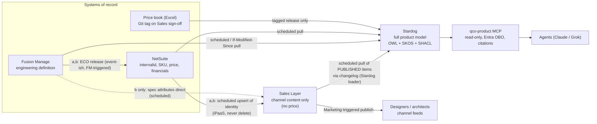

# QCo Options Brief: Where Sales Layer PIM Fits Alongside Fusion Manage, NetSuite and Stardog

**From:** Knowledge Graph Architect
**For:** Chris (Director of AI & Technology)
**Date:** 2026-10-07
**Version:** v0.5 (2026-10-07; v0.5: the load plan runs on QCo's existing product loading pipeline (Claude Cowork and Claude Code); v0.4: committed ten-day plan to load the remaining ~40% of products, sub-assemblies included; v0.3: Chris is pilot ontology owner, and a superseding note was added to the FM/ISA-95 brief; draft for discussion; not yet Analyst-signed). v0.2 changes: the VP of Marketing owns Sales Layer and certifies its content; Stardog holds all QCo products, assemblies and sub-assemblies as the complete semantic product model (SHACL, SKOS, OWL). See §9 for the delta.
**Type:** Advisory, target state. This is not an implementation plan and assumes no rollout date.
**Builds on:** `QCo-KG-Field-Authority-Table-Draft.md` (v0.3) · `QCo-KG-Two-Lane-MCP-Stub.md` (v0.2) · `QCo-KG-Crosswalk-Steward-Role-Card.md` (v0.2) · `QCo-FusionManage-ISA95-Stardog-Architecture-Brief.md` (2026-09-25) · `../research/QCo-KB-Split-Stardog-ISA95-and-Company-KB-Research-Pack.md` (§DF-2, §DF-4) · `../research/QCo-Grok-MCP-Entra-Research-Pack.md`

---

## 0. Bottom line

1. **Sales Layer earns a place only as the marketing and channel content tool.** That means descriptions, imagery, spec sheets, and syndication to lighting designers and architects. It must not become a second item master, and it should not hold price.
2. **Its identity has to come from NetSuite.** Every Sales Layer product carries the NetSuite `internalid`. Sales Layer never creates SKUs on its own.
3. **Technical attributes come from Fusion Manage.** Sales Layer can display them, but it doesn't own them. A spec sheet is valid only if it is stamped with the FM item and revision it was built from.
4. **Agents never connect to Sales Layer directly.** They reach published Sales Layer content only through QCo's own read-only `qco-product` server, under the user's own identity, with citations. Sales Layer's own MCP server has a "Full access" profile that can create, update and delete records, including prices. Its login is also a catalog-level token, not a per-user identity. So it stays off the agent path.
5. **Recommended option: (a) FM → NetSuite → Sales Layer for identity, with (c) "defer the PIM" as the honest alternative.** Option (b), where FM feeds Sales Layer directly, is the most tempting and the riskiest on thin IT. Section 2 explains why.
6. **Cost:** Sales Layer pricing is quote-only ([pricing page](https://www.saleslayer.com/pricing)). I have no QCo quote, so this brief gives no cost figures.

---

## 1. Division of responsibilities

The rule from the field-authority table still holds. There is one product entity, keyed on the NetSuite `internalid`. Every field has exactly one winning system, and there is no third item master (Field Authority v0.3 §1–2). Sales Layer adds a new row family: **channel content**.

| Concern | Fusion Manage (PLM) | NetSuite (ERP) | Sales Layer (PIM) | Stardog (knowledge graph) |
|---|---|---|---|---|
| **What it is in plain terms** | Where engineering defines the product | Where the business sells, ships and accounts for it | Where Marketing dresses it for the market | The complete semantic product model: every product, assembly and sub-assembly, linked to all three systems, so AI can answer questions with sources |
| Product identity key | FM item + revision (engineering identity) | **`internalid` = the spine** (owner) | Stores the `internalid` as a pointer. Never mints SKUs | Links FM ↔ NetSuite ↔ Sales Layer through the certified crosswalk |
| Items, EBOM, change orders, engineering docs | **Owner** | Consumer (via release) | Not held, or read-only display copy | **Full model** of all products, assemblies and sub-assemblies, loaded from FM releases with provenance. FM stays the authoring source |
| Technical / spec attributes (CCT, lumens, IP rating, cut increments, etc.) | **Owner** | Selected fields as consumer | Displays them, stamped with FM item + rev. **Not the owner** | Modeled for every product with provenance (OWL classes, SKOS vocabularies). SHACL checks for drift |
| SKU, selling name, active flag, tax, inventory | Evidence only | **Owner** | Consumer | Projection |
| **Price, cost, currency** | Never | **Owner** (with CPQ engine). Price book = versioned Excel (Marketing), Sales sign-off triggers a Git tag | **None. No price fields** (see §1.1) | Loads **tagged price-book releases only**, ACL-restricted |
| Financials and transactions | Never | **Owner** | Never | Never certified. Live read or snapshot at most |
| Marketing descriptions, imagery, spec-sheet layout, designer/architect channel feeds | Never | Never | **Owner** | Pointer + citation to *published* items only |
| Ontology, vocabularies, rules (ISA-95, OWL, SKOS, SHACL) | Not supported in FM | Not supported | Not supported | **Owner** of the model and the checks |
| Write path | FM users and integrations | NetSuite users and integrations | Marketing users and approved integrations, under the VP of Marketing | Loaders write only to their own named graphs. Agents never write |

**Stardog scope (v0.2, per Chris).** Stardog will hold **all** QCo products and **all** their assemblies and sub-assemblies, using OWL for the product and configuration model, SKOS for controlled vocabularies (product families, finishes, CCT names, synonyms) and SHACL as the data-quality gate. That makes Stardog the complete product spine for meaning and relationships, not a partial link layer. As of 2026-10-06 about 60% is loaded (top sellers and complex SKUs). Until the rest is loaded, products not yet in the graph return `unknown_item` / `non_authoritative`, never a guess. That is a load-progress gap, not a design limit.

**Spine vs authoring source (reconciliation).** "Complete spine" means Stardog is the one place where every product's full structure and meaning can be queried. It does not change who writes the facts. Under the Sep 28 rulings, Fusion Manage still authors engineering definition (items, EBOMs, revisions), NetSuite still mints identity (`internalid`) and owns price and transactions, and Sales Layer authors channel content. Stardog loads released data from each source into its own named graphs, with provenance, and SHACL rejects anything that breaks the model. Nobody edits product facts directly in Stardog except through governed loads.

**Supersedes the thin-crosswalk baseline.** The FM/ISA-95 brief (§5) recommended Option B, a thin crosswalk store, as the starting point, with Stardog as a reversible upgrade. That recommendation is now superseded: Stardog is the full semantic product model. The crosswalk survives as a set of certified identity links *inside* Stardog (FM item ↔ `internalid` ↔ Sales Layer ID), still approved by the crosswalk steward. The FM/ISA-95 brief now carries a superseding note pointing here (added in v0.3).

### 1.1 Should Sales Layer touch price at all?

**Recommendation: no.** Not list price, not "MSRP for designers," not a display price.

- QCo already has a controlled path: Marketing edits the Excel price book, Sales signs off, the sign-off creates a Git tag, and only tagged releases load into Stardog. A second price surface in Sales Layer would sit outside that tag and outside Sales approval.
- Sales Layer's own materials present price editing as a normal PIM use. The MCP "Full access" profile is described as able to "update prices or descriptions in bulk" ([MCP product page](https://www.saleslayer.com/ai-pim/mcp)). The capability exists, so the guard has to be QCo policy plus data model: **no price attribute in the Sales Layer schema.**
- Spec-grade custom-cut product is quoted, not sold off a list. If designers need a price, the answer is "request a quote" routed to CPQ, not a number on the spec sheet.
- **Fallback if Sales insists on a published list price:** keep it in NetSuite/CPQ and show it at the channel edge (website or quote portal) from NetSuite. Don't store it in Sales Layer.

---

## 2. Data flow and sync options

### 2.1 What Sales Layer can actually do (summary; full evidence in §7)

- **No webhooks or outbound events found in its docs.** Change detection is by **polling changelog endpoints** (Catalog REST API) or the legacy connector API's `last_update` timestamp. Treat Sales Layer as **scheduled pull only** until shown otherwise.
- **Rate limit:** 50 requests per 10 seconds (documented).
- **No native NetSuite, Fusion Manage or Stardog connector found.** NetSuite links are offered through solution partners. FM and Stardog would need iPaaS or custom work.

### 2.2 Options

**Option (a): FM → NetSuite → Sales Layer (identity chain).**
FM releases the engineering item to NetSuite (the FM→NetSuite integration already in the target architecture). NetSuite then seeds Sales Layer with `internalid`, SKU, selling name and active flag. Marketing enriches content in Sales Layer. Any technical attributes Sales Layer shows come through NetSuite, or are read at spec-sheet build time from Stardog/FM with a revision stamp.

**Option (b): FM → Sales Layer directly for technical attributes.**
NetSuite still seeds identity, but FM pushes spec attributes straight into Sales Layer. That makes two inbound feeds into Sales Layer.

**Option (c): Minimal or deferred PIM.**
No Sales Layer for now. Spec sheets are built from certified FM attributes plus NetSuite identity (via Stardog), stored as certified DocSlices (FM/ISA-95 brief §9.1). Channel syndication stays manual or uses existing tools. Revisit when the triggers in §6 fire.

In option (c), drop the Sales Layer node. Spec sheets come from FM + NetSuite via Stardog as certified DocSlices.

### 2.3 Flow details per option

| Flow | (a) | (b) | (c) | Event or scheduled | Who triggers |
|---|---|---|---|---|---|
| FM → NetSuite item/BOM release | Yes | Yes | Yes | Event-driven on ECO release where the integration supports it; otherwise scheduled | FM change approval (Product Development) |
| NetSuite → Sales Layer identity (`internalid`, SKU, name, active) | Yes | Yes | — | **Scheduled** upsert-never-delete (Sales Layer has no inbound event model found; NetSuite-side events would depend on the iPaaS) | iPaaS schedule; new SKU set up in NetSuite |
| FM → Sales Layer spec attributes | Via NetSuite or build-time read | **Direct, scheduled** | — | Scheduled | iPaaS schedule |
| Sales Layer → Stardog (published content pointers) | Yes | Yes | — | **Scheduled pull** via changelog endpoints | Stardog loader schedule |
| Sales Layer → channels | Yes | Yes | Manual / existing | Marketing publish action | Marketing |
| Price book → Stardog | Yes | Yes | Yes | Event: Git tag | Sales sign-off |

### 2.4 Comparison

Ratings are relative judgments, not measured figures. No costs are quantified, because I have no Sales Layer, iPaaS or partner quotes.

| | (a) FM → NS → SL | (b) FM → SL direct | (c) Defer PIM |
|---|---|---|---|
| **IT effort** | Medium: one new integration (NS→SL), likely through a partner or iPaaS, since no native connector was found | **High**: two new integrations into SL, one of them FM→SL with no native connector; two mappings to maintain | **Low**: no new platform; uses flows already planned |
| **Divergence risk** | Low–medium: one identity path; technical attributes lag NetSuite's copy of FM | **High**: FM values reach SL by two routes (direct and via NS), and they can disagree | Lowest: no third copy of product data |
| **Cost** | SL subscription (quote-only) + NS→SL connector/partner (unpriced) + iPaaS share | SL subscription + two connectors (unpriced) | No new license. Marketing staff time for spec sheets and channel feeds (unquantified) |
| **Marketing value** | Full PIM benefits | Full PIM benefits, fresher spec data | Limited: no syndication tooling, no DAM |
| **Fit with constraints** | Good | Poor on thin IT | Good, but leaves the channel problem unsolved |

**Why not (b), even though it looks cleaner:** going FM-direct feels like it avoids NetSuite "getting in the way," but it creates a second path for engineering truth into a marketing tool, which is exactly the duplicate-master pattern the field-authority table forbids. If Marketing needs fresher spec values than NetSuite carries, the better fix is building spec sheets at publish time from FM/Stardog with a revision stamp, not a standing FM→SL feed.

---

## 3. Certified-slice discipline: what from Sales Layer may enter the agent path

This applies the Certified-Slices rule (FM/ISA-95 brief §9.1) and C3 pointers-only (Sprint 1 plan; Next-Steps brief) to Sales Layer.

**Eligible:**
- Products, variants and categories with status **`V` (visible)**. The Catalog API's accepted statuses are `V` visible, `I` invisible and `D` draft ([Catalog API overview](https://docs.api.saleslayer.com/apis/catalog)). QCo should treat only `V` *and* channel-published as eligible.
- Spec sheets and DAM files that are linked to a `V` product **and** carry: owner, review-by date, version, and an **FM item + revision stamp**.
- Marketing descriptions and approved imagery for `V` products.

**Excluded:**
- `D` (draft) and `I` (invisible) records. Pending workflow revisions (which the API already hides from reads; same source).
- Unapproved or unlinked DAM assets.
- **Any price, discount or cost field.** If one appears, the loader refuses it and raises an alert.
- Any technical attribute that is not FM-stamped. Agents get technical values from FM via `get_product_context`, never from Sales Layer copy.

**How agents see it:**
- A new read-only tool on `qco-product`, for example `list_channel_content(internalid)`, or an extension of `list_doc_slices` with `type=channel`. It returns **pointers + citations** (Sales Layer item ID, version, owner, review-by date, FM rev stamp) and short published text. It runs under the user's Entra identity (OBO), with ACL re-checked in the MCP layer.
- Flags reused from the MCP stub: `uncertified` (no owner / review-by / version), `stale` (review-by date passed, or FM rev stamp superseded), `source_conflict` (SL text contradicts an FM value), `unknown_item` (no certified crosswalk; this includes the ~40% not yet in Stardog).
- The company lane (`qco-company`) gets Sales Layer content only through `ask_product`, as pointers. It never caches it (MCP stub §5 rule 3).

---

## 4. Risks and mitigations

| # | Risk | What it looks like at QCo | Mitigation |
|---|---|---|---|
| R1 | **NetSuite item data diverges from Sales Layer "product truth"** | Marketing renames a product or edits a length range in SL; NetSuite still says otherwise; designers quote off SL | Extend the field-authority table (§5 rec 1): selling name, SKU and active flag are NetSuite-winner, read-only in SL. Stardog SHACL shape compares SL vs NS values and raises `source_conflict` |
| R2 | **Duplicate SKU master** | SL lets Marketing create a "product" for a new family before NetSuite has an item | Hard rule: no SL product without an `internalid`. SHACL check: every SL product resolves to exactly one `internalid`. Orphans are reported to the steward, never auto-linked |
| R3 | **Spec sheet conflicts with the FM revision** | ECO changes lumens/W or cut increment; SL spec sheet still shows the old rev | Every spec sheet carries FM item + rev stamp. On ECO release, stamped sheets for superseded revs become `stale` in the agent path and land in the Marketing owner's queue. Steward's "new rev approved before effective date" rule extends to spec-sheet re-issue |
| R4 | **Price leaks into Sales Layer** | Someone adds a "List price" attribute for a designer portal; it drifts from the tagged price book | No price attributes in the SL schema (policy). Loader refuses price-like fields. Periodic SHACL/metadata check of the SL attribute list for currency fields |
| R5 | **Integration sprawl on thin IT** | NS→SL partner connector + FM→SL + SL→Stardog + channel connectors, all owned by nobody | Prefer option (a) or (c). One iPaaS, one owner on Chris's app plane (not the MSP). Each flow logged in the flow table with a named business owner |
| R6 | **Write-capable connector in the agent path** | Someone adds Sales Layer's hosted MCP in Full access mode to Claude/Grok; an agent bulk-edits descriptions or deletes a product (the docs note `delete_product` removes the product and its variants) | Vendor MCP blocked at the Claude/Grok admin level (Chris). Agents use `qco-product` only. Even read-only vendor MCP stays off the agent path, because its Catalog Token is catalog-wide, not per-user |
| R7 | **Shared API key with broad reach** | One `X-API-KEY` identifies the whole account; per-field or read-only REST keys not found in the docs | Vault the key; give the Stardog loader its own key if Sales Layer can issue one; scope by API area (Catalog vs DAM) where support allows; rotate. Confirm read-only key availability with the vendor (open question) |
| R8 | **Crosswalk steward overload** | Adding SL IDs to the crosswalk adds rows on top of the FM go-live peak | SL IDs link to `internalid`, not to FM. Seed them from the NS→SL load as pre-filled `candidate` rows, approved in bulk. Same pattern as the steward role card §6 |
| R9 | **Load gap for the ~40% not yet in Stardog (temporary; ten-day load target, see §8 Q9)** | Agent shows SL marketing copy for a product with no engineering link | Return `unknown_item` / `non_authoritative`, never marketing copy presented as spec truth |

---

## 5. Integration recommendations (within the constraints)

1. **Extend the field-authority table** (v0.4) with a §3.6 "Channel content" family. Winner for marketing description, imagery, spec-sheet layout and channel feed config = **Sales Layer (owner: VP of Marketing)**. For technical attributes shown in SL, winner stays **FM**. For identity, winner stays **NetSuite**. Price: SL is **not permitted**. The Analyst signs, as with v0.3.
2. **Identity is pushed one way only: NetSuite → Sales Layer.** Upsert, never delete. Retirements set SL status to `I`, not delete. SL → NetSuite write-back: none.
3. **Managed connector or iPaaS over custom code.** No native NetSuite connector was found, so ask Sales Layer which partner or iPaaS route it supports for NetSuite, and get a quote. No custom glue code owned by one person.
4. **Scheduled pulls, because events weren't found.** The Stardog load step (an extension of QCo's existing product loading pipeline, not a new loader) polls SL changelog endpoints on a schedule, keeps well under the 50 req/10 s limit, and loads only `V` records into its own named graph. If Sales Layer later documents webhooks, switch to those.
5. **Agents: `qco-product` only.** Add the channel-content read tool, with OBO, citations and flags. No vendor MCP (read-only or full) is registered in Claude or Grok org settings for general users. Chris enforces this as admin of Claude, Grok and Azure.
6. **No standing writes.** The integration that seeds SL holds its own narrowly scoped credential, separate from anything the knowledge layer or agents can reach (FM/ISA-95 brief §9.3).
7. **Ownership:** platform owner on Chris's app plane. Business and system owner = **VP of Marketing** for Sales Layer and its content. **The MSP owns network and endpoints only, never the SL platform or its integrations.**
8. **Spec sheets carry a revision stamp** (FM item, rev, effective date, build date). This is a template field, so it's cheap to add now.

---

## 6. Decision asks for Chris

1. **Confirm Sales Layer's role as channel content only, not an item master.** *Recommendation: confirm. Add the "Channel content" family to the field-authority table v0.4.*
2. **Rule that Sales Layer holds no price in any form.** *Recommendation: yes. Price stays in NetSuite/CPQ and the Git-tagged price book. Designers get "request a quote."*
3. **Pick the sync pattern.** *Recommendation: option (a), FM → NetSuite → Sales Layer, if the PIM proceeds. Reject (b). Keep (c), defer the PIM, as the default until a NetSuite→Sales Layer connector route and a quote are in hand.*
4. **Ban vendor MCP servers (including Sales Layer's) from the agent path in Claude and Grok org settings.** *Recommendation: yes. All Sales Layer access for agents goes through read-only `qco-product` with Entra OBO.*
5. **Confirm the VP of Marketing as owner and certifier of Sales Layer content (owner, review-by date, version, FM rev stamp).** *Recommendation: confirm. The VP of Marketing owns the system and holds certification authority. Name a day-to-day content curator in Marketing, accountable to the VP, who prepares and checks content; only the VP's (or a formally delegated) approval moves content to `V`. Keep the crosswalk steward (Product Development) a separate person, because certifying marketing content and approving identity links are different checks.*
6. **Authorize vendor questions before any commitment** (webhooks, read-only/scoped REST keys, hosting region, NetSuite connector route, pricing). *Recommendation: yes. Treat the answers as gates for choosing (a) over (c).*
7. **Confirm Stardog as the complete semantic product model (all products, assemblies, sub-assemblies; OWL, SKOS, SHACL), superseding the thin-crosswalk baseline.** *Recommendation: confirm, with FM, NetSuite and Sales Layer remaining the authoring sources and Stardog loaded only from released data.* **Ontology owner (decided for the pilot): Chris owns the OWL/SKOS/SHACL model day to day during the pilot.** This is a pilot assignment; a permanent owner will likely be needed as the model scales to all products and sub-assemblies.

---

## 7. Sales Layer facts: verified, partial, unverified

Researched 2026-10-07 from first-party Sales Layer sources. Confidence: **High** = stated explicitly in current developer docs; **Medium** = marketing page or indirect; **Low/Unverified** = not found.

| Topic | Finding | Confidence | Source |
|---|---|---|---|
| REST API | Catalog REST API v2.0 (Stable) and DAM REST API (Beta); base `https://api2.saleslayer.com`; OpenAPI 3.0.1; OData-style `$filter/$top/$skip` | High | [docs home](https://docs.api.saleslayer.com/), [Catalog overview](https://docs.api.saleslayer.com/apis/catalog) |
| Connectors API (legacy) | Older bulk API using Export/Import Connectors, each secured with a connector token; incremental via `last_update` (UNIX time); config change triggers a full sync | High | [Support: API intro](http://support.saleslayer.com/channels-integrations/api/introduction), [extraction logic](http://support.saleslayer.com/api/api-operation-logic-data-extraction-mode-output) |
| REST auth | Account-level API key in `X-API-KEY` header; key issued by Sales Layer support | High | [Authentication](https://docs.api.saleslayer.com/guides/authentication) |
| Rate limit | 50 requests / 10 seconds | High | [Rate limiting](https://docs.api.saleslayer.com/guides/rate-limiting) |
| Webhooks / events | **Not found.** Docs point to changelog endpoints for incremental sync, which implies polling | Medium (absence) | [Catalog overview](https://docs.api.saleslayer.com/apis/catalog) |
| Read-only / scoped REST keys | **Not found / unverified.** A 403 hint suggests keys may be limited per API area (DAM vs Catalog); no read-only or field-level scopes documented | Low | [Quickstart](https://docs.api.saleslayer.com/guides/quickstart) |
| Official MCP server | Yes, hosted at `mcp.saleslayer.com`; 71 tools in Full access; Read-only profile exposes the read subset; included with the license | High | [MCP overview](https://docs.api.saleslayer.com/mcp-server), [changelog](https://docs.api.saleslayer.com/changelog), [MCP product page](https://www.saleslayer.com/ai-pim/mcp) |
| MCP read vs write | Two profiles: Read-only (`/onlyread/mcp`) and Full access (`/full/mcp`) with create/update/delete products, variants, categories, DAM; vendor marketing cites bulk price updates. The server does not enforce a two-step confirm for every write; client approval is "a client control, not a guarantee" | High | [MCP permissions](https://docs.api.saleslayer.com/mcp-server/permissions) |
| MCP auth | OAuth 2.0 + PKCE (S256); user pastes a **Catalog Token** that grants catalog-wide access. No Entra ID / per-user SSO mapping found | High (mechanism); Unverified (Entra) | [MCP authentication](https://docs.api.saleslayer.com/mcp-server/authentication) |
| Native NetSuite connector | **Not found.** NetSuite work is offered via solution partners (e.g., Code of the North) | Medium | [Connectors](https://www.saleslayer.com/features/connectors), [partner page](https://www.saleslayer.com/partner/code-of-the-north) |
| Native Autodesk / Fusion Manage connector | **Not found.** Generic "connect ERP, PLM" claims only | Medium (absence) | [PIM for manufacturers](https://www.saleslayer.com/pim-for-manufacturers) |
| Native Stardog connector | **Not found / unverified** | Medium (absence) | Connectors page above |
| Record status | Status values `V` visible, `I` invisible, `D` draft (default `D`); pending revisions under a legacy approval workflow are excluded from reads | High | [Catalog overview](https://docs.api.saleslayer.com/apis/catalog) |
| Workflows / approvals | Parallel and sequential workflows, approvals, task assignment, version control and audit log advertised; detailed approval semantics not verified | Medium | [Features](https://www.saleslayer.com/features), [Pricing](https://www.saleslayer.com/pricing) |
| Versioning / rollback | Backups and rollback to previous versions advertised; changelog API records `author_type` (`api`, `agent`, `unknown`) | Medium (rollback); High (changelog) | [SaaS PIM page](https://www.saleslayer.com/saas-pim-software), [Catalog overview](https://docs.api.saleslayer.com/apis/catalog) |
| Hosting | AWS, ISO 27001 | Medium | [SaaS PIM page](https://www.saleslayer.com/saas-pim-software) |
| Hosting region / data residency | **Not found / unverified** | — | — |
| Pricing | Quote-only; no public figures | High | [Pricing](https://www.saleslayer.com/pricing) |

---

## 8. Open questions and unverified items

1. **Webhooks:** does Sales Layer offer outbound webhooks or events on publish/status change? (Not found.)
2. **REST key scoping:** can Sales Layer issue a **read-only** API key, and keys scoped to API area or catalog? (Not found.)
3. **Per-user identity:** does any Sales Layer access path support Entra ID SSO or per-user tokens usable for OBO? (Not found; the MCP uses a catalog-wide token.)
4. **Hosting region:** which AWS region(s), and can QCo pin US residency? (Not found.)
5. **NetSuite route:** which partner or iPaaS connector does Sales Layer support for NetSuite, and at what price? (Partner-only found.)
6. **Approval workflow:** does "approved" in a Sales Layer workflow map reliably to status `V`, or can Marketing set `V` without approval? This affects whether `V` alone is enough for certification.
7. **Pricing:** no Sales Layer, partner or iPaaS costs are known. All cost comparisons in §2.4 are qualitative.
8. **Who at QCo asked for a PIM, and for which channels?** If the driver is designer spec sheets only, option (c) may cover it.
9. **Stardog load plan (committed, v0.4):** Chris has set a hard target to load the remaining ~40% of products, sub-assemblies included, within ten days, by 2026-10-17. The mechanism is QCo's **existing product loading pipeline**, already implemented in Claude Cowork and Claude Code and used for the first ~60%. No new load tooling is built for this push; the work is running more families through that pipeline. Risk: ten days is aggressive for a small IT team, and SHACL failures on the long tail and on deep sub-assembly structure are where loads usually slip. Suggested sequencing, as an operating order for the existing pipeline rather than new tooling: (1) load product-level records and NetSuite identity links for every remaining product first, so `unknown_item` disappears early; (2) then load sub-assemblies, highest-volume and most complex families first; (3) run loads per product family in parallel only where families share no sub-assemblies, so SHACL failures stay contained; (4) review SHACL failures daily and have the pipeline park failing records rather than relaxing the shapes to hit the date. Track daily: products loaded, sub-assemblies loaded, SHACL pass rate. Until a product passes, it still returns `unknown_item` / `non_authoritative`.
11. **Graph operations on thin IT:** a complete product model raises the load, SHACL-maintenance and ontology-ownership burden (the skill gap flagged in the FM/ISA-95 brief). For the pilot, Chris owns the model day to day. Open: who becomes the permanent owner as the model scales, and when to decide.
10. **Carried over:** MBOM host (discovery), crosswalk steward individual (due ~Oct 28), U4 store path. See Field Authority v0.3 §7.

---

## Sign-off

| Role | Action | Status |
|---|---|---|
| Knowledge Graph Architect | Draft | Done 2026-10-07 (v0.1); revised 2026-10-07 (v0.2) |
| QCo Analyst | Review | Pending |
| Chris | Decision asks §6 | Pending |

---

## 9. What changed in v0.2

**Ownership.** The VP of Marketing owns Sales Layer and certifies its content. A day-to-day curator in Marketing prepares content under the VP. The crosswalk steward stays a separate person.
- *Certification authority:* `V` (published) counts as certified only when the VP or a formal delegate approved it. Open question 6 (does approval reliably set `V`?) now also asks whether Sales Layer can restrict publishing to that approver.
- *Field-authority table:* the "Channel content" family names the VP of Marketing as accountable owner.
- *Unchanged:* the sync pattern, the no-price rule and the vendor MCP ban. Marketing also manages the price book, so the rule that price never enters Sales Layer matters more, not less: the same executive owns both, and it's an easy shortcut to take.

**Stardog scope.** Stardog is now the complete semantic product model for all products, assemblies and sub-assemblies (OWL, SKOS, SHACL). The thin-crosswalk baseline from the FM/ISA-95 brief is superseded. Authoring sources are unchanged.
- *Sync pattern:* still FM → NetSuite → Sales Layer for identity. Stardog adds a full load from FM releases (including sub-assembly structure) and NetSuite identity, plus published Sales Layer content into its own named graph. SHACL now checks Sales Layer content against the full model, for example a spec sheet whose FM revision is out of date.
- *Certified slices:* unchanged for Sales Layer (published, owner, review-by, version, FM rev stamp). For the graph, only SHACL-valid data loaded from released sources counts as certified. Sales Layer text never overrides a modeled engineering value.
- *How agents query:* still only through read-only `qco-product` under each user's Entra ID, with fixed tools and citations. Because the model is complete, those tools can answer structure questions ("what sub-assemblies go into this product", "which products use this driver") once loading finishes. No raw SPARQL is exposed to agents.
- *New risk:* running a full ontology on thin IT needs a named ontology owner (open question 11, decision 7).

## 10. What changed in v0.3

- Decision 7: Chris is the ontology owner day to day for the pilot. This is a pilot assignment, and a permanent owner may be needed as the model scales.
- A short superseding note was added to `QCo-FusionManage-ISA95-Stardog-Architecture-Brief.md`, replacing its thin-crosswalk recommendation.

## 11. What changed in v0.4

- Open question 9 now records the committed hard target: load the remaining ~40% of products, sub-assemblies included, within ten days (by about 2026-10-17). It also adds the schedule risk and a suggested sequencing: products and identity links first, then sub-assemblies, parallel loads by family only where families don't share sub-assemblies, and failing records quarantined rather than shapes loosened.

## 12. What changed in v0.5

- The load plan (§8 Q9) now names QCo's existing product loading pipeline, built in Claude Cowork and Claude Code, as the mechanism for the 2026-10-17 target. The sequencing is framed as an operating order on top of that pipeline. The Sales Layer pull in §5 is described as an extension of the same pipeline, not a new loader.
