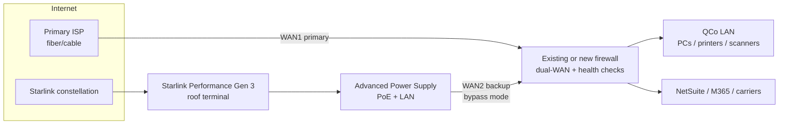

# QCo Starlink Backup Internet — Business Proposal

**Prepared for:** CFO / Leadership  
**Requested by:** Chris, Director of AI and Technology  
**Date:** 2026-09-28  
**Context:** Facility internet outage on 2026-09-25 interrupted manufacturing and shipping (NetSuite + cloud apps). This proposal recommends a Starlink business backup link.

**Pricing note:** Starlink and carrier pricing varies by region and changes often. Figures below were checked on **2026-09-28** from the cited sources. Confirm final checkout pricing for QCo’s service address before purchase. Taxes, shipping, and possible demand/congestion surcharges are **not** included unless noted.

---

## 1. Executive summary

**Recommendation:** Deploy **Starlink Local Priority (business) service** on a **Performance Gen 3** terminal as an always-on **automatic failover** backup behind QCo’s firewall (Starlink in **bypass mode**). Keep the existing primary ISP; use Starlink only when that link fails health checks.

| Item | Figure (estimate unless cited) |
|------|--------------------------------|
| **Recommended plan** | Local Priority **50 GB** — marketed by Starlink for backup connectivity — **$55/mo** ([starlink.com/us/business/fixed-site](https://www.starlink.com/us/business/fixed-site), checked 2026-09-28) |
| **Recommended hardware** | Starlink **Performance Gen 3** kit — **$1,999** ([Winegard authorized listing](https://winegard.com/starlink-performance-gen-3-with-pipe-mount-and-router/), checked 2026-09-28) |
| **One-time cost range** | **~$4,500 – $14,000** (hardware + mounts + UPS + grounding + labor; low / high). **Expected ~$8,000 – $9,000** if existing firewall already supports dual-WAN failover. |
| **Monthly recurring** | **$55/mo** base (+ tax). Optional Priority data top-ups **+$25 per 50 GB** if opted in ([starlink.com/us/business/service-plans](https://www.starlink.com/us/business/service-plans), checked 2026-09-28). |
| **Year-1 TCO (expected)** | Roughly **$8,500 – $10,000** (one-time expected + 12 × $55). |
| **3-year TCO (expected)** | Roughly **$10,000 – $12,000** (one-time expected + 36 × $55), excluding outage top-ups and price changes. |

**Why Starlink (primary recommendation):** Independent of local fiber/cable last-mile and power-company poles that storms often take down; month-to-month; public IPv4 option on Priority plans; installable in days–weeks vs. many second-fiber builds. Cellular 5G and a second terrestrial ISP remain valid alternatives and are compared below — Starlink remains the best first backup for a manufacturing site that must keep NetSuite and shipping alive after a storm-driven wireline outage, unless site survey finds blocked sky view or the MSP already has a ready diverse fiber path.

**200 Mbps requirement:** A single Performance terminal is **advertised capable of 400+ Mbps down** (Starlink Performance specs; gigabit upgrades promised for Performance hardware). **US median Starlink download speeds are ~128 Mbps** (Ookla Q1 2026 via [PCMag / Ookla](https://www.pcmag.com/news/over-120mbps-starlink-speeds-in-the-us-see-sizable-increases), 2026-05-05) — so **sustained 200 Mbps is realistic in good cells with Priority precedence, but not guaranteed**. Upload will typically be far below 200 Mbps (often ~20 Mbps median class). **Bonding two terminals is not recommended as step one**; upgrade plan data and confirm local speeds first. See §3.

---

## 2. Requirements

| Requirement | Detail |
|-------------|--------|
| Business need | Survive primary ISP outages so production can build/ship and corporate cloud apps stay usable |
| Critical systems | NetSuite (third-party hosted), Microsoft 365–type apps, shipping labels / carrier portals; VoIP if present |
| Minimum throughput | **200 Mbps download** target on backup (confirm whether upload symmetry is also required — Starlink upload is lower) |
| Mode | Backup only (primary ISP remains primary) |
| Ops model | Thin internal IT + co-managed MSP |
| Audience | CFO / leadership — plain language, cost clarity, open questions |

**Unknowns (confirm with MSP / facilities):** existing firewall/router make & model and dual-WAN capability; facility address / Starlink cell quality; building and roof type; cable run length to network closet; UPS capacity; whether site-to-site VPN or inbound services exist; VoIP dependency.

---

## 3. Can Starlink meet 200 Mbps?

### Advertised / kit capability
- **Performance Gen 3:** Starlink states the kit is **currently capable of download speeds up to 400+ Mbps**; network upgrades for gigabit-class plans on this hardware are advertised for 2026 ([starlink.com/us/business](https://www.starlink.com/us/business), checked 2026-09-28; [Performance specification PDF](https://starlink.com/public-files/specification_sheet_performance.pdf)).
- **Standard kit:** Suitable for many residential/light business uses; Priority service can run on Standard kit (business page headline hardware **$349**, [liveearthviewer.com](https://liveearthviewer.com/starlink/learn/how-much-does-starlink-cost) citing starlink.com/business 2026-09-07; [Walmart Standard Kit V4 $349](https://www.walmart.com/ip/Starlink-Standard-Kit-V4/5597651559), checked 2026-09-28). Less rugged than Performance for a manufacturing roof.

### Typical / measured speeds (US)
- Ookla: US Starlink **median download ~127–128 Mbps** in Q1 2026; uploads improved with many states ≥20 Mbps median ([Ookla](https://www.ookla.com/articles/starlink-hits-new-us-highs), 2026-05-05; [PCMag](https://www.pcmag.com/news/over-120mbps-starlink-speeds-in-the-us-see-sizable-increases)).
- Speeds vary by cell congestion, weather (rain fade), obstruction, and plan priority. Starlink’s own pages state speeds **are not guaranteed** and slow during congestion.

### Priority data, caps, and what happens past the cap
Local Priority plans are sold by **Priority data allotment**, not by a hard speed tier:

| Local Priority plan | Monthly (US) | Source (checked 2026-09-28) |
|---------------------|--------------|-----------------------------|
| 50 GB | $55/mo | [starlink.com/us/business/service-plans](https://www.starlink.com/us/business/service-plans) |
| 500 GB | $155/mo | same |
| 1 TB | $280/mo | same |
| 2 TB | $530/mo | same |
| +50 GB add-on | +$25/mo | same |
| +500 GB add-on | +$125/mo | same |

After Priority data is exhausted (if auto top-up is **not** enabled): service continues at **unlimited low speed — up to 1 Mbps down / 0.5 Mbps up** (same page). That is **too slow for NetSuite-heavy production**. If auto-purchase of Priority blocks is enabled, additional 50 GB blocks can be added when allotment runs out (Starlink enterprise plan behavior documented in Starlink legal/API materials and reseller FAQs).

**Latency:** Often roughly **25–60 ms** on land for LEO satellite; Ookla reported US median multi-server latency around **~39 ms** in Q1 2026 ([Ookla](https://www.ookla.com/articles/starlink-hits-new-us-highs)). Fine for SaaS; not identical to fiber.

### One terminal vs bonding
- **One Performance terminal** is the right first design: highest chance of hitting **≥200 Mbps down** during an outage without dual-dish complexity.
- **Two-terminal bonding** (SD-WAN load-share) could raise aggregate throughput but roughly **doubles hardware + service cost** and adds MSP complexity. **Not recommended unless** a post-install speed test at QCo’s address shows Priority Performance routinely below ~150 Mbps down under load.
- Upload will **not** meet 200 Mbps on current kits; if QCo’s “200 Mbps” requirement was meant as **symmetric**, that requirement cannot be met with Starlink today — clarify with stakeholders.

---

## 4. Options compared

| Option | One-time (est.) | Monthly | Meets ~200 Mbps down? | Storm resilience | Notes |
|--------|-----------------|---------|------------------------|------------------|-------|
| **A. Starlink Local Priority + Performance (recommended)** | $4.5k–$14k | $55+ | Often possible; not guaranteed | High (independent last-mile) | Public IP option; priority over residential users |
| B. Starlink Standard kit + Local Priority 50 GB | $3.5k–$10k | $55+ | Less headroom for 200 Mbps | High | Cheaper kit; less durable |
| C. Cellular 5G/LTE failover | $0.5k–$3k router + install | $10–$99+ | Plan-dependent; indoor signal risk | Medium (towers can also fail in storms) | Verizon Backup/Flexible from **$10–$30/mo** low-data; 5G Business Internet from **~$69/mo** (promo ~$35 bundled) ([verizon.com/business](https://www.verizon.com/business/products/internet/backup-failover/), [verizon.com/business/products/internet/5g/](https://www.verizon.com/business/products/internet/5g/), checked 2026-09-28). T-Mobile Business Internet from **~$60–$70/mo** ([t-mobile.com/business/internet](https://www.t-mobile.com/business/internet), checked 2026-09-28). |
| D. Second terrestrial ISP (diverse path) | $0–$50k+ construction | Broadband ~$60–$300; DIA ~$300–$1,500 | Yes if provisioned | Medium–high **if** true path diversity | Comcast Business promo plans from **~$60/mo** ([Comcast Business press](https://business.comcast.com/about-us/press-releases/2026/cb-launches-total-solutions-advantage), Mar 2026). DIA ranges **$300–$1,500/mo** ([Socium IT DIA guide](https://www.sociumit.com/resources/blog/dia-providers-comparison-2026), Mar 2026). Lead times and construction vary. |
| E. Manual Starlink switchover only | Lower labor | Same as A/B | Same as kit | High | Human delay during outage — not recommended |

**Standby / pause options (cheaper idle modes):**
- **Roam/Residential Standby Mode:** ~**$10/mo** unlimited ~0.5 Mbps ([LiveEarthViewer](https://liveearthviewer.com/starlink/learn/how-much-does-starlink-cost) citing SpaceX Roam page 2026-09-07) — **does not meet 200 Mbps** and is not a manufacturing backup.
- **Business/Enterprise:** Starlink documents that Business/Enterprise customers can **pause service lines** (often without using consumer Standby Mode) ([Starlink pause FAQ via reseller](https://starlinkpanama.net/en/solutions/faq/how-does-pausing-service-work)). A paused line is **not** ready for instant failover.
- **Practical cheap backup:** keep **Local Priority 50 GB at $55/mo** active year-round (Starlink labels it “Best for back up connectivity”). During a long outage, temporarily raise the data block or enable auto top-ups.

**Upcoming naming/pricing risk:** Enterprise messaging (Sep 2026) indicates Local/Global Priority may be renamed **Business / Global Business Plan** around **2026-12-01**, with possible fee changes ([PCMag](https://uk.pcmag.com/networking/167489/starlink-tips-gigabit-speeds-for-maritime-users-who-own-2000-dish), 2026-09-24). Budget a cushion; re-check starlink.com before signing.

---

## 5. Recommended design

### Plain-language design
1. Primary ISP stays connected to **WAN1** on the firewall.
2. Starlink Performance dish on the roof (clear sky view) → Advanced Power Supply in the network closet → Ethernet into **WAN2**.
3. Put the included Starlink router in **bypass mode** (bridge): it stops acting as Wi‑Fi/router and passes traffic to QCo’s firewall. *Bypass mode* = Starlink’s setting that turns their Wi‑Fi router into a simple bridge so your firewall owns routing/VPN/failover.
4. Firewall runs **health checks** (e.g., ping/HTTP to known targets). If primary fails, **automatic failover** moves traffic to Starlink within seconds–minutes. When primary recovers, fail back (with dampening so flaps don’t bounce).
5. Enable **Public IPv4** on the Local Priority service line (optional but recommended for clearer VPN behavior). *CGNAT* (Carrier-Grade NAT) = many customers share one public address; inbound connections and some VPNs break. Default Starlink is CGNAT; Priority plans can enable a **public IPv4** that is DHCP/sticky but **not a true static IP** ([Starlink Help: What IP address does Starlink provide?](https://www.starlink.com/support/article/1192f3ef-2a17-31d9-261a-a59d215629f4), checked 2026-09-28).
6. Prefer **outbound-initiated** site-to-site VPN / Zero Trust (already typical for NetSuite + M365). Re-test any inbound or peer VPN after Public IP is enabled.

### Failover recommendation: **automatic** (not manual)
Manual switchover saves little money and costs minutes–hours of production during the exact moments QCo cannot afford delay. Automatic dual-WAN (or SD-WAN) is the standard SMB design.

### Simple architecture diagram

---

## 6. Bill of materials (estimates — cite before PO)

| Item | Qty | Unit price | Extended | Source / date checked | Notes |
|------|-----|------------|----------|----------------------|-------|
| Starlink Performance Gen 3 kit (dish, Advanced PSU, 25 m cable, Ethernet/AC/DC cables; mount options) | 1 | **$1,999** | $1,999 | [Winegard](https://winegard.com/starlink-performance-gen-3-with-pipe-mount-and-router/) 2026-09-28; MTNSat lists ~$2,000 | Preferred. 3-yr warranty / 10-yr design life per Starlink marketing |
| *Alt:* Starlink Standard Kit V4 | 1 | **$349** | $349 | [Walmart](https://www.walmart.com/ip/Starlink-Standard-Kit-V4/5597651559) 2026-09-28; business page still quotes $349 hardware | Cheaper; less rugged; 15 m cable included |
| Pipe adapter (Standard) *if* Standard kit | 1 | **$32.99** | $32.99 | [Home Depot](https://www.homedepot.com/p/STARLINK-Pipe-Adapter-Standard-Kit-V4-04759103/330646165) 2026-09-28 | Performance kits often include pipe/wedge mount — confirm kit SKU |
| Pivot mount (Standard, shingle roofs) | 1 | **$74** | $74 | [Home Depot Pivot Mount](https://www.homedepot.com/p/STARLINK-Pivot-Mount-Standard-Kit-V4-04759105/330646164) 2026-09-28 (price value in page data) | Only if penetrating shingle mount is approved |
| Non-penetrating ballast roof mount (2‑⅜″ mast, flat roof) | 1 | **$249 – $475** | same | [Talley FRM238SP5 ~$248.69](https://www.talleycom.com/product/ROHFRM238SP5); [3StarInc ROHN JRM23805 $475](https://www.3starinc.com/rohn-jrm23805-non-penetrating-roof-antenna-mount-2375-in-x-5-ft-mast) 2026-09-28 | Plus concrete ballast + roof pad; structural review |
| Longer cable (Standard 45 m) | 0–1 | **$115** | $115 | [Home Depot 45 m cable](https://www.homedepot.com/p/STARLINK-Standard-Kit-V4-Replacement-Cable-45m-04856100/330646162) 2026-09-28 | Standard max practical runs; Performance supports up to **50 m** PoE cable |
| Performance 50 m cable (optional) | 0–1 | **~$142 – $199** | — | [CDW $141.99](https://www.cdw.com/product/starlink-performance-cable-50m/8428938); [AllOverComm $199](https://allovercomm.com/performance-50-m-164-ft-cable/) 2026-09-28 | Replace included 25 m if closet is far |
| Ethernet PoE surge protector (building entry) | 1–2 | **$34** each (2-pack $68) | $68 | [Tupavco TP303 2-pack $68](https://www.tupavco.com/products/outdoor-ethernet-thunder-lightning-surge-protector-for-poe-2-pack) 2026-09-28 | Bond to building ground; NEC 810 practices |
| Grounding materials (wire, clamps, bonding) | 1 lot | **~$50 – $150** | estimate | Local electrical supply | **Estimate** — electrician quotes |
| UPS for dish PSU + firewall (≈1500 VA) | 1 | **~$240 – $670** | — | CyberPower CP1500PFCLCD commonly ~$240; APC SMT1500C commonly ~$600–$670 ([B&H / Micro Center listings via search](https://www.bhphotovideo.com/c/product/1513053-REG/cyberpower_cp1500pfclcd_pfc_sinewave_ups.html), 2026-09-28) | Confirm runtime for firewall + Starlink (~75–100 W dish avg) |
| Dual-WAN firewall *(only if existing gear cannot failover)* | 1 | **$379 – ~$870+** | — | Ubiquiti Dream Machine Pro **$379**, Dream Machine SE **$499** ([store.ui.com](https://store.ui.com/us/en/products/udm-pro), checked 2026-09-28). FortiGate 40F hardware listings on CDW in ~**$670–$873** range ([CDW FG-40F](https://www.cdw.com/product/fortinet-fortigate-40f-security-appliance/5973095), page amounts observed 2026-09-28) | Prefer extending **existing** MSP-supported firewall if dual-WAN capable |
| Misc (sealant, cable management, outlet, labels) | 1 lot | **$100 – $300** | estimate | — | **Estimate** |

**Cable / power limits (Starlink):** Standard kit ships **15 m** cable (45 m replacement available). Performance ships **25 m**, optional **50 m** max between terminal and power supply (PoE voltage drop). Average power **~75–100 W** (Starlink specs). Dedicated outlet on UPS recommended.

---

## 7. Labor (estimates)

US commercial rates used as planning ranges (not QCo quotes):

- Low-voltage / network tech: roughly **$85 – $150/hr** ([Chicago Network Solutions commercial cabling guide](https://chicagonetworksolutions.com/commercial-network-cable-installation/), Apr 2026).
- Electrician billed rates: roughly **$75 – $150+/hr** commercial ([AceWatt electrical contractor rates](https://acewatt.com/blog/electrical-contractor-hourly-rates), Jul 2026).
- MSP project engineering: roughly **$150 – $275/hr** ([Velo IT Group MSP pricing](https://www.velomethod.com/post/how-much-does-managed-it-services-cost), 2026).

| Task | Hours (low–high) | Rate range | Cost range (**estimate**) |
|------|------------------|------------|---------------------------|
| Site survey / sky obstruction / roof walk | 1–3 | $85–$150 | $85–$450 |
| Roof mount install (penetrating or ballast) | 4–10 | $85–$150 | $340–$1,500 |
| Cable pull dish → closet + weatherproofing | 3–8 | $85–$150 | $255–$1,200 |
| Electrical: dedicated outlet / circuit | 2–5 | $75–$150 | $150–$750 |
| Grounding / bonding / surge install | 2–4 | $75–$150 | $150–$600 |
| UPS install / rack dress | 0.5–1.5 | $85–$150 | $40–$225 |
| Firewall dual-WAN + bypass + VPN retest | 3–8 | $150–$275 | $450–$2,200 |
| Failover testing + documentation | 2–4 | $150–$275 | $300–$1,100 |
| Project mgmt / MSP coordination | 1–3 | $150–$275 | $150–$825 |
| **Labor total** | | | **~$1,900 – $8,900** |
| **Labor expected (mid)** | | | **~$4,800** |

**One-time roll-up (estimate):**

| Scenario | Hardware+materials (approx.) | Labor | Contingency | **Total** |
|----------|------------------------------|-------|-------------|-----------|
| Low (Standard kit, existing dual-WAN FW, easy roof) | ~$2,600 | ~$1,900 | — | **~$4,500** |
| Expected (Performance + NPRM + UPS; existing FW) | ~$3,300 | ~$4,800 | ~$300 | **~$8,400** |
| High (Performance + hard roof + new FortiGate + long pulls) | ~$4,200 | ~$8,900 | ~$1,000 | **~$14,100** |

All labor figures are **estimates** for budgeting; MSP/facilities must quote after site walk.

---

## 8. Recurring costs and TCO

### Starlink monthly (recommended)
- **Local Priority 50 GB: $55/mo** (+ tax) — [starlink.com/us/business/service-plans](https://www.starlink.com/us/business/service-plans), 2026-09-28.
- Terminal Access Charge is **included** in displayed Priority prices ([Starlink Help: Terminal Access Charge](https://www.starlink.com/us/support/article/d3dcd79f-c332-63e7-9204-3c3ec4f104ae), checked 2026-09-28).
- Optional: raise to 500 GB ($155) or 1 TB ($280) if monthly failover testing + rare outages burn the 50 GB Priority allotment, or enable **+$25 / 50 GB** auto blocks during events.

### TCO illustration (expected path: Performance kit, existing firewall)

| Horizon | Calculation | Amount (**estimate**) |
|---------|-------------|------------------------|
| One-time | Expected BOM + labor | ~$8,400 |
| Year 1 service | 12 × $55 | $660 |
| **Year-1 total** | | **~$9,060** |
| Years 2–3 service | 24 × $55 | $1,320 |
| **3-year total** | $8,400 + 36 × $55 | **~$10,380** |

Add: taxes, possible demand surcharge at address, outage top-ups, MSP monthly monitoring if billed separately, and any Dec 2026 plan repricing.

### Brief alternative TCO (for CFO context)

| Alternative | Typical monthly | Typical one-time | When it wins |
|-------------|-----------------|------------------|--------------|
| Cellular backup (low-data Verizon Backup) | $10–$30 + overage | Router $200–$800 + install | Cheap standby for **very** light traffic; **weak** for full plant NetSuite outage |
| Cellular 5G Business Internet | ~$60–$99 (promos lower with phone bundle) | Gateway + install | Good if strong outdoor/indoor 5G at site; verify 200 Mbps |
| Second cable/fiber broadband | ~$60–$300 | Often low if on-net | Best **latency**; confirm **diverse** path (different conduit/carrier) |
| DIA fiber | ~$300–$1,500 | $0–$50k+ construction | Best SLA; longer lead time / higher cost |

**Keep Starlink as primary recommendation** unless MSP confirms (a) excellent 5G at the MDF with dual-carrier SIMs, or (b) a true diverse fiber build with short lead time and moderate construction cost.

---

## 9. Risks and assumptions

| Risk / assumption | Impact | Mitigation |
|-------------------|--------|------------|
| Speeds below 200 Mbps at QCo’s cell | Misses requirement during failover | Order Performance kit; 30-day trial; speed-test before cancel window; optional plan/data increase |
| Sky obstruction / roof constraints | Install delay or infeasible | Site survey first |
| Same storm takes power | Backup internet dead | UPS sized for firewall + Starlink; generator if facility has one |
| CGNAT / IP change breaks VPN | Auth or tunnel failure | Enable Public IPv4; outbound VPN; retest |
| Priority data exhausted mid-outage | Throttle to 1/0.5 Mbps | Auto top-up; temporary plan upgrade; monitor GB |
| Price/plan rename Dec 2026 | Higher OPEX | Re-validate before PO; budget +20% OPEX cushion |
| Rain fade | Brief brownouts | Accept LEO weather risk; still usually better than total wireline loss |
| Assumption: existing firewall can do dual-WAN | If false, add $400–$900+ hardware + labor | MSP confirms model/capabilities |
| Assumption: manufacturing roof allows mount | If false, wall/pole mount engineering | Facilities + structural |

---

## 10. What to confirm with MSP / facilities

1. **Firewall/router make, model, firmware** — dual-WAN / SD-WAN health-check support today?
2. **Primary ISP** — circuit ID, handoff type, any existing backup?
3. **Facility address** for Starlink availability, cell congestion, demand surcharge at checkout.
4. **Building / roof type**, warranty, preferred **non-penetrating vs penetrating** mount; who approves roof work.
5. **Path length** from proposed dish to network closet; plenum vs riser cable needs.
6. **Electrical** — spare circuit near closet; UPS present capacity.
7. **Grounding electrode** location for mast + surge bond (NEC Article 810 practices).
8. **VPN / Zero Trust / SD-WAN** inventory — anything that assumes a stable public IP or blocks CGNAT.
9. **VoIP / phone system** dependency during ISP outage.
10. **Who owns monthly failover test** and alerting (MSP vs internal).
11. **NetSuite bandwidth** during peak shipping (to size whether 50 GB/mo Priority is enough for rare multi-day outages).

---

## 11. Implementation steps and timeline (**estimate**)

| Step | Owner | Duration (est.) |
|------|-------|-----------------|
| 1. MSP/facilities discovery (list in §10) | Chris + MSP | 3–5 business days |
| 2. Starlink address check + order Performance kit + Local Priority 50 GB | Chris / MSP | 1–2 days (shipping varies) |
| 3. Procure mount, surge, UPS, cable | MSP / facilities | Parallel with shipping |
| 4. Roof + cable + electrical + grounding | Facilities electrician + LV tech | 1–2 days on site |
| 5. Bypass mode, dual-WAN, Public IP, VPN retest | MSP | 0.5–1 day |
| 6. Controlled failover test + runbook | MSP + Chris | 0.5 day |
| 7. 30-day Starlink satisfaction window — validate speeds | Chris | Per Starlink trial terms |

**Overall:** often **2–4 weeks** from approval to tested backup, dominated by discovery, roof scheduling, and hardware lead time — much faster than many diverse-fiber projects.

---

## 12. Operations / testing

### Monthly failover test
- **Owner (recommended):** MSP (primary), with Chris as business approver.
- **Procedure (high level):** During a low-risk window, administratively fail WAN1 or unplug primary handoff; confirm NetSuite, M365 web, shipping portal, and label printers work on Starlink; confirm alert fires; restore primary; confirm failback.
- **Duration:** ~15–30 minutes. Track Priority GB used.

### Alerting
- Firewall/SD-WAN alert when **active WAN = Starlink** (email/SMS/Teams to MSP + Chris).
- Optional: Starlink account data-usage alerts near Priority allotment.

### What should stay up on backup
| Service | Expectation on Starlink |
|---------|-------------------------|
| NetSuite | Yes — prioritize; cloud SaaS works over LEO latency |
| Email / M365 | Yes |
| Shipping labels / carrier portals | Yes |
| Internal file servers / printers | Yes if LAN stays up (power permitting) |
| VoIP | Yes **if** softphone/cloud PBX; test codec quality; QoS if needed |
| Heavy CAD / large uploads | May feel slower (upload limited) |

### Outage-cost framing (placeholders for QCo Finance)

Use this to justify the project without inventing revenue:

- Hours of plant downtime avoided per year (from 2026-09-25 and similar events): **___ hrs**
- Fully loaded cost of idle production labor per hour: **$___ / hr**
- Orders that cannot ship without NetSuite per hour: **___ orders** × margin **$___**
- Expedite / customer penalty risk per multi-hour outage: **$___**
- **Avoided loss per outage** ≈ (labor idle) + (missed margin) + (penalties/expedites)
- Compare to **~$9k year-1** / **~$10–12k 3-year** Starlink expected TCO.

Even **one** multi-hour shipping outage often exceeds year-1 cost — Finance should fill placeholders from actuals.

---

## 13. Decision request

Approve budget envelope of approximately:

- **One-time:** up to **~$14,000** (expected ~$8,000–$9,000 if firewall already dual-WAN capable)
- **Monthly:** **$55** Local Priority 50 GB, with authority to temporarily raise data tier or enable auto top-ups during declared outages
- **Next action:** MSP discovery call (items in §10) → firm quote → order Performance kit

---

## Appendix A — Source log (checked 2026-09-28 unless noted)

| Topic | URL |
|-------|-----|
| Starlink Business / Performance claims | https://www.starlink.com/us/business |
| Fixed-site Local Priority marketing | https://www.starlink.com/us/business/fixed-site |
| Local/Global Priority prices | https://www.starlink.com/us/business/service-plans |
| Performance kit PDF | https://starlink.com/public-files/specification_sheet_performance.pdf |
| IP / CGNAT / Public IP | https://www.starlink.com/support/article/1192f3ef-2a17-31d9-261a-a59d215629f4 |
| Terminal Access Charge | https://www.starlink.com/us/support/article/d3dcd79f-c332-63e7-9204-3c3ec4f104ae |
| Independent price compilation | https://liveearthviewer.com/starlink/learn/how-much-does-starlink-cost (read 2026-09-07 figures) |
| Ookla US speeds | https://www.ookla.com/articles/starlink-hits-new-us-highs |
| Performance kit retail $1,999 | https://winegard.com/starlink-performance-gen-3-with-pipe-mount-and-router/ |
| Standard kit $349 | https://www.walmart.com/ip/Starlink-Standard-Kit-V4/5597651559 |
| Mounts / cable (Home Depot) | Pipe adapter, Pivot, 45 m cable product pages cited above |
| NPRM mounts | Talley FRM238SP5; ROHN JRM23805 pages cited above |
| Ubiquiti UDM Pro / SE | https://store.ui.com/us/en/products/udm-pro ; `/udm-se` |
| FortiGate 40F CDW | https://www.cdw.com/product/fortinet-fortigate-40f-security-appliance/5973095 |
| Verizon backup / 5G BI | https://www.verizon.com/business/products/internet/backup-failover/ ; `/internet/5g/` |
| T-Mobile Business Internet | https://www.t-mobile.com/business/internet |
| DIA pricing context | https://www.sociumit.com/resources/blog/dia-providers-comparison-2026 |
| Labor rate contexts | AceWatt; Chicago Network Solutions; Velo IT Group pages cited above |
| Plan rename / gigabit note | https://uk.pcmag.com/networking/167489/starlink-tips-gigabit-speeds-for-maritime-users-who-own-2000-dish |

---

*End of proposal.*
